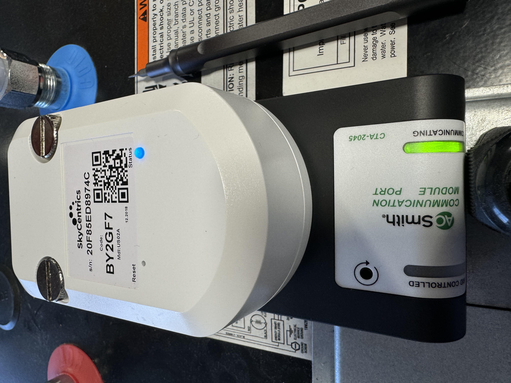
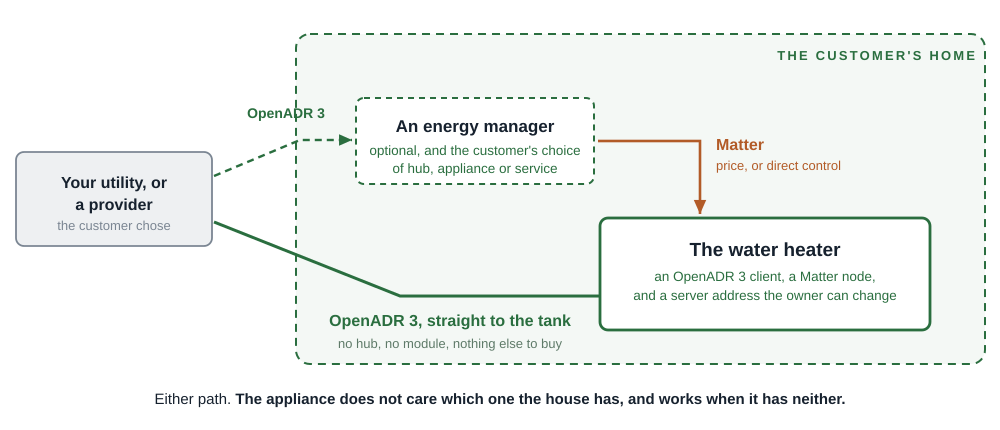
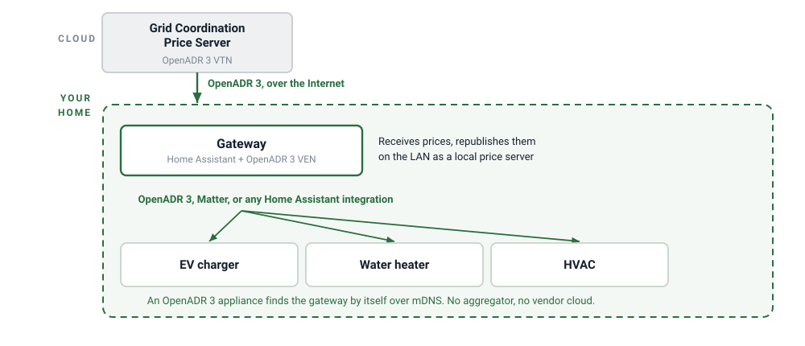
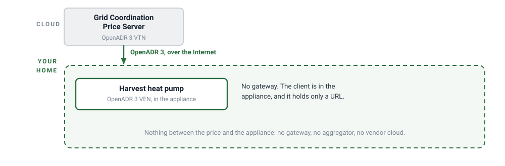
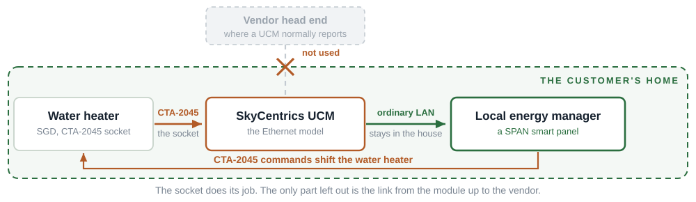
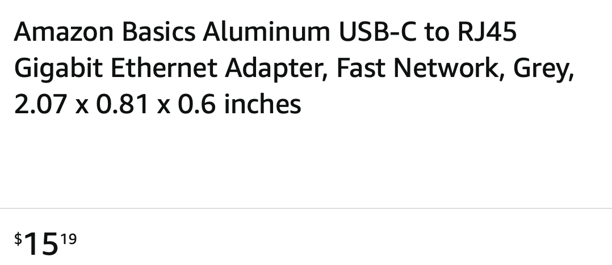
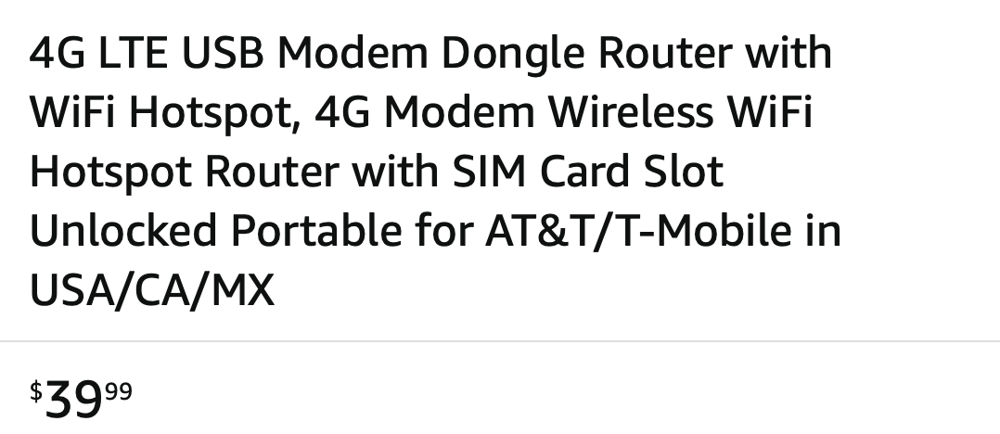
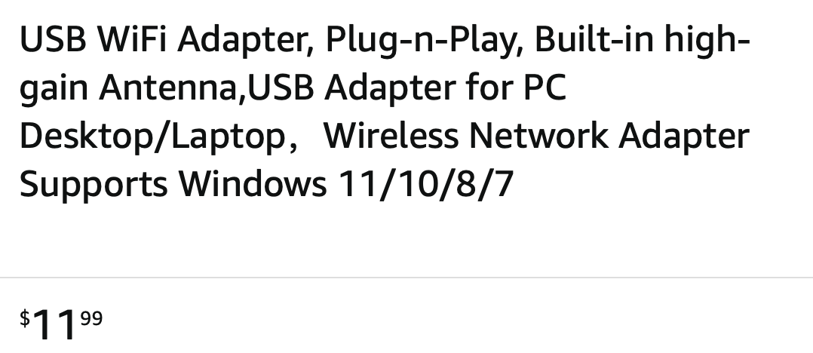

<!-- _class: alt -->
<!-- _paginate: false -->
<!-- _footer: "" -->

### Advanced Water Heater Initiative · Connectivity Working Group

# Water heaters: is it time to move on from CTA-2045?

The design was right for 2013, but the world has changed.

DC Jackson · grid-coordination.energy

---

<!-- _class: dense2 -->

### The goal

## Why coordinate water heaters with the grid?

- **What.** Give high-load appliances the ability to shift *when* they consume, and to back off when the grid needs them to. **An electric storage water heater is the cheapest thermal battery in the house**, and the best candidate there is: it already stores energy, and nobody notices when it heats.
- **Cost.** Deliver that flexibility affordably, and put the cost where it will actually get paid. Every approach puts it somewhere: on the manufacturer as unit and development cost, on the utility as program cost, or on the customer as money and effort. **The question is never whether there is a cost. It is who pays it, and whether they notice.**
- **Control.** Let the flexibility be managed from wherever produces the most benefit: by the utility or load-serving entity, by a demand response provider, **or by the customer's own energy management system.** The appliance may ship pre-configured for any of the three. **The customer must be able to change which one manages it, and from where.**

---

<!-- _class: dense2 -->

### The 2013 design

## The opportunity was real, and the design was right for its time

- **The opportunity was real, and still important.** An electric storage water heater is the cheapest thermal battery in the house. Getting it to shift is worth doing, and in 2013 essentially nothing in a house could receive an outside signal at all.
- **The engineering solution was correct for 2013.** A water heater lasts twelve to fifteen years. Putting the network interface in a replaceable module and standardizing the socket between the module and the appliance was a good cost tradeoff.
- **Ex ante, this seemed like a good solution.** The challenge was not the standard, but what happened above the UCM, and the mandates that named the standard.

**Thirteen years have passed. Let's assess how it has worked, and whether a course correction might be called for.**

---

<!-- _class: dense2 tight -->

### So we are using the same words

## A socket in the appliance, and a module the customer chooses

The appliance carries the socket. The module carries the network interface. **The link at the top is whatever the module vendor chose.**

- **SGD, the appliance.** The CTA-2045 socket and the microcontroller behind it. The appliance's behavior in response to a signal is deliberately not specified: the committee left that to the manufacturer on purpose.
- **UCM, the module.** The other half of the socket, a network interface (Wi-Fi, cellular or Ethernet), a microcontroller of its own, and a link upstream to a demand response provider.
- **The premise, in CTA's own words:** "Consumers select an appropriate communications module to plug into their appliances based on the networking system... in their homes."
- **That premise has two halves.** The appliance half is a socket, and it got built. The customer half is a market of modules to select from.

---

<!-- _class: dense2 tight tighter -->

### WHERE THE OPEN PART STOPS TODAY

## The socket is open. The decision about who reaches it is not.

- **The price object is in the message set. Nothing standardizes how a real tariff reaches it.** Which price arrives, and from whom, is decided by whichever cloud the module vendor runs. **That is outside CTA-2045 by design, and the design is the problem.**
- **CTA-2045's own architecture figure labels the segment above the module "Any Communication System."** Deliberately, and correctly: the standard scopes itself to the socket and says so. **A rule that stops where the standard stops inherits that boundary.**

---

<!-- _class: tight -->

### THE GOAL, AND THE DISTANCE FROM IT

## Every new water heater should ship able to coordinate

**Not a pilot, not a program, not a subset of one state. Every new electric storage water heater sold**, the way every one of them already ships able to heat water. **That is the only target worth writing a rule for**, and it is the target the mandate was written to reach.

| | |
| --- | --- |
| **None reported** | No grid-enabled water heater additions reported in Washington, Oregon or New York, in any year 2020 through 2024, in the federal field that asks |
| **39** | CTA-2045 modules deployed in Oregon's largest water heater demand response pilot, against 11,703 retrofit switches |
| **2,000** | The unit cap on Washington's largest utility's first water heater demand response product, launched 2025 |
| **5&nbsp;million** | US residential electric storage water heaters shipped, **per year** |

No published participation rate exists, at NEEA, BPA, EPRI, PNNL, DOE, either state commission, EIA, AHRI or the EcoPort certified product database. These are the numbers that do. **Against five million a year, none of them is within sight of the goal.** Sources and caveats in the appendix.

---

<!-- _class: tight -->

### WHAT THE RULE REQUIRES, AND WHAT IT LEAVES TO CHANCE

## Enabled is not ensured

ENABLED

A port on the appliance, and a promise that some other device the customer has not bought yet will do the rest. **Success left to chance.**

ENSURED

An open protocol in the appliance, a network interface, and a server address the owner can change. **The customer plugs it in, and it participates.**

---

<!-- _class: tight -->

### WHAT STANDS BETWEEN THE PORT AND A CONNECTED APPLIANCE

## Every connected water heater costs a module and a visit

- **A module.** Bought by the program operator at volume pricing, not by the customer at retail. Assume roughly **$100**, or **$150** for cellular. **Every new enrollment costs another one.**
- **An installation.** In the garage, in a closet, behind the furnace.
- **A network join.** Which nobody notices failing later, because nothing else stops working.

**Everything in this photograph is a second computer alongside the first one.**

**A per-unit cost caps program size.** Washington's largest utility launched at 2,000 units in 2025, giving the module away and paying $20 toward the install. **A client already in the appliance costs nothing per unit.**

---

<!-- _class: tight -->

## When the gap is too wide to jump

Four jurisdictions required the port. The distance from the port to a connected appliance turned out to be three steps:

- **A $100+ second computer**
- **An installation**
- **A network credential typed in a basement**

Every one of them had to be crossed by a customer who did not know (or care) that the port existed, and was under no obligation to use it.

**Nobody designing this in 2013 could have known the jump was that wide, or could have done substantially differently. We know now.**

---

<!-- _class: tight -->

### THE PREMISE, AND WHAT HAPPENED TO IT

## The premise is gone, and the cost case has inverted

- **In 2013 appliances did not have a network connection.** So put the network interface in a replaceable module and standardize the socket.
- **Rheem's ProTerra page lists both on one model:** "Built-in Wi-Fi Powered by EcoNet" **and** a "built-in EcoPort (CTA-2045 port)." **The customer paid for two connections, and exactly one of them is reachable by anyone other than Rheem.**
- **And a physical port splits the product line.** The mandate is why any of these models exist, and nobody would have built them otherwise. But a port costs money and four states require it, so it ships as a demand-response variant: Rheem's compliance bulletin lists eight, by state, and the cheapest carries the port and **no Wi-Fi at all**. **Firmware does not split a product line, but a significant BOM cost does.**

**In 2013 a radio in every appliance was the expensive option.** On a water heater that already ships with Wi-Fi, the module is a second computer doing what the first one already does. **Mandating the socket is now the more expensive way to reach the same appliance.**

---

<!-- _class: tight -->

### THE RIGHT LEVEL FOR A GRID SIGNAL

## The grid should be concerned with a customer's total demand, not individual appliances

- **A DR event is addressed to one appliance, so the model starts from a list of houses.** Somebody has to know it exists, be permitted to reach it, and keep that path alive for twelve to fifteen years.
- **A price is appliance agnostic, addressed to nobody in particular.** One signal, the same for everyone on the tariff, and nobody enrolled in anything. **The water heater reads it and decides for itself.**
- **Control can be local, or in the cloud.** A customer operating their own equipment, through a controller they chose, is exactly right. **Act on a price it reads for itself, rather than wait to be addressed by name.**

---

<!-- _class: tight -->

### The design target

## Two interfaces, and a water heater needs both

#### Interface A, across the grid boundary

A **price with a forward schedule**, over an open protocol, from a server the customer can point somewhere else.

#### Interface B, inside the house

If the customer runs an energy manager, it should be able to **drive the appliance directly, over the home network**.

**The appliance should be able to do either, so the customer chooses.** Receive the price and decide for itself, or take direction from something in the house that has the price.

---

<!-- _class: tight -->

### WHAT IS ALREADY IN THE APPLIANCE, AND WHAT TO ADD

## The hardware is already there. This is firmware.

**Many water heaters already ship with a microcontroller and a Wi-Fi interface**, because the manufacturer wanted a cloud client of its own. **The ask is firmware on hardware the customer has already paid for**: no new part, no new silicon, no second computer.

| | |
| --- | --- |
| **OpenADR 3** to the grid | A price with a forward schedule, a day ahead in one object, from **a server address the owner can change**. Ordinary web technology: HTTPS over TLS, JSON, OAuth 2. **Explicitly not PKI.** Against a public tariff server, all the appliance holds is a URL |
| **Matter** inside the house | Local control by whatever energy manager the customer runs, **and the appliance appearing in the home ecosystem app the customer already uses.** **Water Heater Management** for the appliance's own controls, **Device Energy Management** for the energy semantics a manager negotiates against |

**The manufacturer's own cloud, over whatever protocol it likes, is the manufacturer's business and is not in scope here.** Keep it, make it the default. **The ask is only that it not be the only way in.**

---

<!-- _class: tight -->

### WHY BOTH, AND NOT EITHER ONE ALONE

## Matter alone is enabled, not ensured

| | Matter only | OpenADR 3 only | Both |
| --- | :--: | :--: | :--: |
| **Can it get a price?** | Only if something on the home network already has one | Yes, directly | Yes, either way |
| **Can an energy manager drive it?** | Fully | Via price | Fully |
| **Verdict** | **Enabled** | **Ensured, for price** | **Ensured, and controllable** |

**Matter is local by construction. There is no cloud-mediated Matter.** For a Matter-only water heater to act on a price, an energy manager the customer has to acquire must already have one. **That is the same shape of failure as the socket:** the appliance is ready, and a second purchase stands between it and participation. The distance is shorter and closing. Shorter is not zero.

**With both, an energy manager has three ways to work:** publish the local price over Matter's own price clusters, publish it over OpenADR 3 as a local server, or drive the appliance directly over Device Energy Management. **And a house with no energy manager is still served.**

---

<!-- _class: tight -->

### Testable language. No version numbers.

## Write the capability, not the standard

| Write this, in the rule | Not this |
| --- | --- |
| A price with a forward schedule, over an open protocol, **received by the appliance itself** | "A modular port compliant with [named standard, named edition]" |
| A server address **the owner can change** | "The manufacturer shall provide a demand response interface" |
| **Action on the last schedule with no network** | Nothing, which is what these rules say today about outages |
| **Both** the water-heater-specific and the generic energy-management semantics | "Shall support [a smart home standard]" |

**The same gap exists with Matter.** The Matter Water Heater device type does not require Device Energy Management at all, and inside DEM every adjustment feature is optional. **A fully certified Matter water heater can ship with no forecast and no shiftability**, which is exactly why a rule must name the capability and not the protocol.

---

<!-- _class: dense2 tight tighter -->

## My proposal

- **Retire CTA-2045 as a water heater requirement.** Not an additional compliance path. Not a fix to the link above the socket. **Retire it.** The port competes with the better answer for the same dollars and the same engineering attention.
- **Require instead, of the appliance itself, three things.** **One: both protocols.** OpenADR 3 to the grid, and Matter inside the house covering **both** Water Heater Management and Device Energy Management. **Two: at least one network interface**, integrated. Everyone will choose Wi-Fi, and that is fine. **Three: support for adding another**, as a USB-C host port for a class-compliant adapter. Ethernet or cellular becomes the customer's choice, without putting three radios in every unit.
- **Write the capability and the test method. Put standards in an appendix.** Name OpenADR 3 and Matter. Name no edition of either, and no version number anywhere in the requirement itself. **Naming a protocol is not the mistake. Freezing an edition of it is**, and that is the mistake in force today.
- **This needs no new legislation to start.** Washington and Oregon already let a manufacturer ask the state to accept an equivalent open standard. **Nobody has ever asked.** The rules and the empty list are in the appendix.

---

<!-- _class: tight -->

### MY PRICE SERVER, AND THE HOME ASSISTANT INTEGRATION

## OpenADR 3 price servers are here today, via EMS

**One device knows the retailer and the tariff, and the rest of the house reads the price from it.**
**The price server**, with client tutorials: github.com/grid-coordination/price-server-user-guide
**Home Assistant integration**, in the HACS default repository: github.com/grid-coordination/openadr3-ven-hass

---

<!-- _class: tight -->

### INTERFACE A, WITHOUT A GATEWAY

## OpenADR 3 price servers are here today, direct to appliance

**The Harvest heat pump runs the OpenADR 3 client itself, so all it holds is a URL.** No gateway to buy, nothing to enroll in, and no vendor cloud in the path.

---

<!-- _class: tight -->

### HACKING CTA-2045

## Local control via CTA-2045

**I put a SkyCentrics Ethernet UCM on a CTA-2045 water heater and reached it over the home network.**
SPAN's PowerUp energy manager, in a smart panel on the same LAN, sent CTA-2045 commands, and the water heater shifted energy.
**The UCM never reached a vendor cloud.**

---

<!-- _class: tight -->

### THE CODE THAT DID IT

## Both libraries are open source

- **github.com/electrification-bus/python-cta2045** Encodes and decodes the SGD-to-UCM message set, including shed, end shed, load up, critical peak and grid emergency.
- **github.com/electrification-bus/cta2045-proxy** Proxies the UCM to MQTT, and supports an appliance-agnostic data model.

---

<!-- _class: dark -->

### Backup

## Detail

---

<!-- _class: dense2 -->

### THE TWO OBJECTIONS I TAKE SERIOUSLY

## Obsolescence, and the patch obligation

- **The obsolescence argument still holds, and it is the strongest part of the 2013 case.** A water heater lasts twelve to fifteen years and home networking does not stand still for twelve to fifteen years. Putting the network interface in a replaceable module is the textbook answer to a component whose lifetime is shorter than its host's.
- **The answer is that the replaceable part got smaller and cheaper.** The USB-C host port is the replaceable radio, at $4.76 for an adapter instead of a $100 module, and a configurable server address is the replaceable cloud. **What has to survive fifteen years is a URL and an HTTPS client, not a radio.**
- **The cost objection I take seriously is not the silicon.** It is that a client in the appliance is a fifteen-year patch obligation on a company whose service organization exists to replace anodes.
- **The answer is that the obligation already exists.** The manufacturer accepted it the moment it shipped a cloud-connected model, and a second, open client on the same stack does not double it.

---

<!-- _class: dense2 tight -->

### Connectivity, which is its own subject

## A utility measured the radio problem

- **Garage, basement, utility closet, behind the furnace.** Concrete, ductwork, and the far end of the house from the router.
- **PGE, to the Oregon PUC, on its own water heater DR pilot:** "cell-enabled switches have a higher connectivity rate (**79% season average**) than wi-fi connected switches (**50% season average**)... showing constant signal degradation."
- **PGE stopped retrofitting water heaters with Wi-Fi in October 2019.** Those were retrofit switches, not CTA-2045 modules. Same radio, same basement.
- **An SSID or password change disconnects the module silently**, and nobody notices, because nothing else stops working.
- **The remedy is boring: Ethernet.** Water heaters are not mobile. Incentivize a drop at installation and require one near high-amperage outlets in code. **A USB-C Ethernet adapter is $4.76.**

**93% of US households have an Internet subscription. Only 76.5% have fixed broadband** (ACS 2024, table B28002). For an appliance joining a home network, 76.5% is the figure that applies. Equity gaps belong in assistance programs, as with electric service.

---

<!-- _class: dense tight -->

### PUBLIC RETAIL LISTINGS, CHECKED AUGUST 31, 2026

## What a module costs, and what a program pays

| Listing | Price | What recurs |
| --- | --- | --- |
| **Modbus / Ethernet UCM** | **$169** | None listed |
| **Wi-Fi UCM** | **$209** | A platform fee, prepaid for a year at checkout: **$209 list, $221 in the cart** |
| **Cellular UCM** | **$249.99** | The page states "Price for 1-20 modules is $249/unit, **plus $36 annual Platform Fee**" |
| **A.O. Smith EcoPort communications package** | **$349** | Cellular |

**These are small-quantity retail listings. Program operators, not customers, buy these modules, and they buy at volume.** **The working assumption in this deck is roughly $100 a unit for Wi-Fi or Ethernet and roughly $150 for cellular**, stated as an assumption because no volume price list is public. The retail figures above are the upper bound. In a program the customer often pays nothing: Puget Sound Energy gives the module away from the PSE Marketplace and adds a $20 installation incentive. **That is a real answer to the price objection, and it does not remove the cost. It moves it to the program budget, where it competes with every other measure for the same dollars.**

**The recurring fee is the part that has no equivalent in firmware.** A client in the appliance reuses the radio, the TLS stack and the credential store the customer already paid for, and carries no annual platform fee at all. **These are public store prices, so they are what a homeowner would pay, not what a program pays.**

---

<!-- _class: dense2 -->

### INTERFACE A, IN DETAIL

## What the client actually has to implement

- **Transport and identity.** HTTPS over TLS, JSON payloads, OAuth 2 client credentials for the token. **Explicitly not PKI:** provisioning X.509 certificates into consumer devices is "daunting at best, or simply not supportable."
- **A price-consuming client is a token fetch and two authenticated GETs**, `/programs` and `/events`, or MQTT push where the appliance sits behind a home router. **A server offering only public tariff information may accept unauthenticated requests, so all the appliance holds is a URL.**
- **That the owner can change it is already a normative MUST.** Verbatim: "A VEN MUST support end-user configuration of: VTN URL, clientID and clientSecret... but MUST support end-user reconfiguration." **The rule's job is to make an existing MUST testable**, not to invent a new requirement.
- **A price is not a number, it is a schedule.** A start, an ISO 8601 duration, and an ordered list of intervals: a day ahead in one object.
- **The specification names this appliance.** Verbatim: "VENs may be implemented within on-site customer devices such as **a water heater**..."
- **What the appliance already has, and does not buy twice:** the microcontroller, the TLS stack, the JSON parser and the credential store, all shipped the moment the manufacturer added its own cloud client. **The cost that does not amortize is support: a patch obligation for the life of the product.**

Both quotations are verbatim. The appliance is a VEN in OpenADR terms; the demand response provider runs the VTN.

---

<!-- _class: dense tight -->

### THE DRAFTING LANGUAGE

## Six requirements, as rule text

| Write this, in the rule | Not this |
| --- | --- |
| The water heater shall receive a price with a forward schedule over an open protocol, **implemented in the appliance itself** | "Shall have a modular demand response communications port compliant with [named standard, named edition]" |
| The server address shall be configurable by the owner **without the manufacturer's participation** | "The manufacturer shall provide a demand response interface" |
| The appliance shall retain and act on the last received schedule **with no network connection** | Nothing, which is what every one of these rules currently says about outages |
| The appliance shall expose **both the water-heater-specific and the generic energy-management** semantics on the home network | "Shall support [a smart home standard]" |
| At least one integrated network interface, **plus a USB-C host port accepting a class-compliant network adapter** | "One or more network interfaces" |
| A customer may take the signal directly, **with no enrollment and no intermediary** | "Customers participate through a program administrator" |

**ENERGY STAR already built the alternative door.** Residential Water Heaters Version 5.0, effective April 18, 2023, section 4.D.a: the connected product "shall meet the communication and equipment performance standards for **CTA-2045 or OpenADR 2.0b (Virtual End Node), or both**." An open-protocol client in the appliance has been an accepted alternative for three years. **The version named is a cloud-to-cloud protocol that was never designed to live in an appliance, so the door was open onto a wall.**

**The equivalency route, verbatim.** WAC 194-24-180(3) and OAR 330-092-0020(16)(b) both direct the department, **on written request by a manufacturer**, to determine whether an alternative standard that is "open and widely available" is equivalent, and to publish any it accepts. Oregon's rule adds that it encourages manufacturers to ask other states too. **Neither department has published a determination. That list is empty.**

---

<!-- _class: dense2 -->

### PRICE IN CTA-2045, SINCE THE FIRST EDITION

## CTA-2045 does carry a price. The gap is above the module.

- **What is true:** price has been in CTA-2045 since the first edition. Present Relative Price and Next Relative Price, a Set/Get Energy Price message with an absolute price, an ISO currency code, a decimal field, an expiry and a next price. **CTA-2045-B Level 2 requires a day-ahead price schedule: "Prices to Devices - Can accept 64 time/price pairs for 24 hour ahead smart planning."** The committee added time-price pairs for CA Title 24 JA13, then deliberately skipped time-of-use to aim at real-time dynamic pricing. **60 of the 62 certified EcoPort products are Level 2.** This is not a paper feature.
- **What is missing:** the price object exists in the message set, and **there is no standardized way for a real tariff to reach it**, because the link above the module is undefined. The schedule is 64 points over 24 hours, so it is a day-ahead schedule rather than a live price. And which price arrives, and from whom, is decided by whichever cloud the module vendor runs.

The quoted feature list is the OpenADR Alliance's own: **CTA-2045-B Level 2 Guidance for Water Heater OEMs**, section 6, time price pairs. Level 2 count from the EcoPort certified product database, counted August 31, 2026.

---

<!-- _class: dense2 -->

### THE NEXT EDITION

## CTA-2045-C is a live project, not yet a document

- **The project is real.** CTA's R7.8 subcommittee launched CTA-2045-C in January 2025, to "provide improvements to the standard interface for energy management signals and messages to reach devices." CTA-2045.4, an implementation guide, is also active.
- **Nineteen months on, both are still listed under Active Projects. Nothing is published.** Nineteen months is not slow for a standards project. It is normal, and the people doing it are volunteers.
- **Its announced scope is improvements to the same socket-side interface.** It says nothing about the link above the module.
- **A rule can only be written against a published document.** What -C will contain, beyond its published scope statement, is not yet knowable.

CTA standards news, **"CTA Launched Project CTA-2045-C, Modular Communications Interface for Energy Management,"** January 2025. Both CTA-2045-C and CTA-2045.4 still appear under Active Projects on CTA's current projects page, checked August 31, 2026.

---

<!-- _class: dense2 -->

### AHRI 1430

## It closes the behavior gap, not the reach gap

- **What it is, stated fairly.** AHRI 1430-2022 builds on CTA-2045 rather than replacing it. It adds test procedures, conformance conditions and appliance behavior requirements above the message set. Colorado and New York name it; Rheem's compliance bulletin treats the three as one family, "ANSI/CTA-2045-A, ANSI/CTA-2045-B or AHRI 1430."
- **It fixes something real, and something CTA-2045 left open on purpose.** NEEA: within CTA-2045 "the lack of descriptive SGD behavior in response to messaging was intentional," so two compliant water heaters could answer the same Shed request differently. 1430 constrains that. **It is a genuine improvement and I am not arguing against it.**
- **It does not change what is on the other side of the socket.** A 1430-compliant water heater still has a port and no network interface. The customer still buys a module, installs it and joins it to Wi-Fi. **Nothing above the module is standardized by either document.**
- **So it makes the appliance behave predictably once something is talking to it.** It does not make anything talk to it, and it does not let the customer choose who does.

The same is true of any future edition. **Testing behavior below the socket and defining reach above it are different problems**, and only the first one is being worked.

---

<!-- _class: dense2 -->

### THE RECORD

## The same proposal, on a CEC docket in 2024

- **The failure mode was named then, not in hindsight.** A 2024 response in **CEC Docket 24-FDAS-03** put it in a footnote: CTA-2045 "hasn't been an unqualified success," and "its dependence on aftermarket, costly UCMs has posed significant obstacles to widespread use and adoption."
- **So was the fix, including the protocol.** Same footnote: "The solution is to mandate the control and status-reporting capabilities (defined first by CTA-2045) into modern open standard protocols (e.g. OpenADR3) that can be incorporated into the integrated network interfaces (especially Wi-Fi) that new water-heaters typically provide."
- **What has changed since is the evidence, not the argument.** Two more model years, four jurisdictions still, and the participation record in these exhibits.

Public, and still on the docket. **The ask in this deck is two years old, and nothing since has cut against it.**

---

<!-- _class: dense2 -->

### THE OBJECTION

## "You are trading a tested standard for an untested one"

- **The concession, first and without hedging.** The Matter energy clusters are largely specification today, with little shipping product behind them. Water Heater Management arrived with Matter 1.4. **That part of the objection is correct.**
- **The two gaps are not the same kind.** CTA-2045's gap is structural: the premise requires a module market, and thirteen years and four mandates produced **four modules from three vendors against fifty-eight certified appliances**. Matter's gap is maturity in a platform whose owners have already committed: Apple, Google, Amazon, Samsung, LG and roughly 400 member companies.
- **This industry has already made exactly this bet, in the other direction.** Washington made the socket law for units manufactured on or after **January 1, 2021**. The first EcoPort certified products were announced **October 26, 2022**: the socket was law twenty-two months before there was a way to certify a product against it.
- **And half the ask does not depend on any of this.** OpenADR 3 is HTTPS, TLS, JSON and OAuth 2, already running in every water heater that talks to its manufacturer's cloud. That half is available now, with no ecosystem required. The half still arriving only adds.

**A known failure is not the safer bet against an uncertain one.** And a profile that moves can be met with a firmware update; a port that was the wrong bet cannot.

---

<!-- _class: dense tight -->

### The mandate record

## Four jurisdictions, instrument by instrument

| Jurisdiction | The instrument | What it requires |
| --- | --- | --- |
| **Washington** | RCW 19.260.080; **WAC 194-24-180** | Sale prohibited without a CTA-2045 port. Statute says on or after Jan 1, 2021; the rule applies from **Jan 1, 2023**. Since March 2026 the rule accepts **-A or -B** |
| **Oregon** | **OAR 330-092-0015(16)** and **-0020(16)** | Sale prohibited without a CTA-2045-A port, units manufactured on or after **July 1, 2023**. HB 2062 said Jan 1, 2022; ODOE postponed twice, and called the second the last one it could grant administratively |
| **Colorado** | **C.R.S. 6-7.5-105(5)(d)**, added by HB23-1161 | Sale or lease prohibited on and after **Jan 1, 2026** without a port compliant with **AHRI 1430**. 40 to 120 gallons, 12 kW or less |
| **New York** | **2025 ECCCNYS** R403.5.4 and C404.8 | Not a sales rule. **A building energy code requirement, enforced at permit**, effective **Dec 31, 2025**. Units manufactured on or after July 1, 2025 must meet **AHRI 1430** |

**Three prohibit the sale. One binds the builder at permit**, which is why Rheem's September 2025 compliance bulletin lists Colorado, Oregon and Washington, not New York. **Colorado and New York name AHRI 1430, which is not a move away from CTA-2045.** AHRI 1430-2022 builds on it: the standard's stated purpose is to confirm that equipment communicates "using CTA-2045-B", and it adds the test procedures and appliance behavior requirements that CTA-2045 deliberately left to the manufacturer. Rheem's compliance bulletin treats them as one family: "ANSI/CTA-2045-A, ANSI/CTA-2045-B or AHRI 1430".

**Credit where it is due:** four jurisdictions did the genuinely hard work of writing an appliance rule and defending it. That is more than most states have managed on any flexible demand question.

---

<!-- _class: dense2 -->

### THE ECOPORT CERTIFIED PRODUCT DATABASE, COUNTED AUGUST 31, 2026

## 58 appliances. 4 modules.

- **62 certified listings.** 58 Smart Grid Devices, mostly heat pump water heaters. **4 Universal Communication Modules**, from Steffes, e-Radio and SkyCentrics. 60 of the 62 are certified at CTA-2045-B Level 2.
- **Certification is voluntary and no mandate requires it**, so 62 is a floor, not a census. It is the only public count there is.
- **The premise was consumer choice**: the customer selects a module suited to their home. After thirteen years and four mandates, that is what there is to select from. Three vendors built for a market of four states with no committed volume.
- **Each module terminates in its own vendor's head end.** Steffes into the Steffes head end, e-Radio into e-Radio's cloud, SkyCentrics into SkyCentrics' platform. **Two compliant water heaters with modules from different vendors are not reachable by the same demand response provider.**

---

<!-- _class: dense tight -->

### PARTICIPATION

## The five records, with sources

**No published rate exists.** Not at NEEA, BPA, EPRI, PNNL, DOE, the Oregon PUC, the Washington UTC, EIA, AHRI, or the Alliance's own product database.

| Source | What it says |
| --- | --- |
| **Form EIA-861, Schedule 6, line 7** | **No utility in Washington, Oregon or New York reported adding one**, in any year 2020 through 2024. Some entered zero, most left the field blank. PSE reports 601,946 residential DR customers and leaves the field blank; PGE reports 192,617 and leaves it blank. Colorado's entries are essentially all Fort Collins, and not CTA-2045 |
| **Portland General Electric**, Oregon PUC, April 2022 | "the pilot has deployed **11,703 water heater retrofit switches and 39 CTA-2045 enabled** new Smart Water Heaters communication devices" |
| **PGE again**, June 2023 | Closed the pilot to new enrollments and extended it two years, to allow "increasing availability of CTA-2045 enabled water-heaters so PGE can resume installations." **PGE paused installations and waited for certified equipment to exist** |
| **Puget Sound Energy**, 2025 DR Equity Action Plan | Washington's largest utility launched its first water heater DR product in **Q2 2025**, at ordinary first-year pilot scale, **2,000 units**, the module free from the PSE Marketplace and a $20 installation incentive |
| **AHRI shipment statistics** | About **5 million** residential electric storage water heaters shipped in the US in each of 2023, 2024 and 2025 |

**Line 7 is annual additions, not stock, and not CTA-2045 specifically.** A floor, not a census.

**Five independent sources point one way and none points the other.** Against roughly five million units a year, the connected count is not one percent, and not a tenth of one percent. **If it were otherwise, one of these five would show it.**

---

<!-- _class: dense tight -->

### CTA-2045

## Every date that matters

| | |
| --- | --- |
| **2013** | ANSI/CEA-2045, published by the Consumer Electronics Association with the Smart Grid Interoperability Panel |
| **March 2018** | **ANSI/CTA-2045-A.** The edition Washington's statute and Oregon's rule name |
| **September 2019** | **ANSI/CTA-2045-B**, ANSI version February 2021. Still the current published edition |
| **January 1, 2021** | Washington's statutory date. Commerce is authorized to set a later one, and does |
| **October 26, 2022** | The OpenADR Alliance announces the **first EcoPort certified products**. Twenty-two months after the date Washington's statute named |
| **January 1, 2023** | Washington's rule, WAC 194-24-180, actually applies. Commerce delayed it two years, for supply chain |
| **January 2025** | CTA-2045-C project launched. Nineteen months later, nothing published |

**The socket was written into law before there was a way to certify it.** Washington's statute named 2021; the first certifications came in October 2022, and Commerce had by then moved the operative date to 2023. The certification program ran about two years behind the Alliance's own published schedule.

**Federal: nothing.** S.4061 and H.R.7962 would have had DOE decide by December 31, 2024 whether to require demand response capability on electric storage water heaters. Both died in committee. **DOE has never been asked the question.**

---

<!-- _class: dense2 tight -->

### WHAT CARRIES OVER WHEN THE SOCKET RETIRES

## The semantics are already expressible somewhere else

- **The other standard's own text says so.** OpenADR 3 User Guide, section 8.11: "OpenADR 3 is well suited to be a standard external protocol for CTA-2045B... For many capabilities of CTA-2045, e.g. sending prices, an emergency signal, or reporting energy use, there are existing mechanisms in OpenADR that implement the functionality. For a few capabilities, enumeration values specific to CTA-2045 have been added."
- **Those enumerations are in the payload registry**, `CTA2045_REBOOT` and `CTA2045_SET_OVERRIDE_STATUS`, both pass-through for resources that support CTA-2045-B, and the user guide says a document giving an unambiguous mapping between the two standards is forthcoming. **Retiring the socket delivers the same semantics without the $100+ part.**

---

<!-- _class: dense -->

## The same rule text, as bench tests

**A capability nobody can test is a capability nobody will adopt.** Appliance rules run on test methods. Each line below is measurable on a bench in an afternoon, with no help from the manufacturer, and every one of them is something Washington's current rule explicitly does not do.

| Capability | What the lab measures |
| --- | --- |
| **Open protocol in the appliance** | Point the water heater at a reference server on the bench. It connects and acts, with the manufacturer's cloud unreachable |
| **Customer-configurable server** | Change the server address using only the appliance's own interface, with no vendor account and no vendor app. Time it |
| **The price is consumed** | Publish a day-ahead price schedule. Observe the heating decision change |
| **Local survival** | Deliver a schedule, then cut the WAN. The appliance keeps acting on the retained schedule for the full horizon |
| **Network interfaces** | Present Ethernet, Wi-Fi and cellular in turn, integrated or over USB-C. Each reaches the configured server |
| **No enrollment** | Connect to a reference server with no account creation, no program enrollment and no intermediary. It receives and acts |

---

<!-- _class: dense2 -->

### MATTER, INTERFACE B

## The water heater clusters, by name and by content

- **Water Heater Management, 0x0094, revision 2.** Read `HeaterTypes` (immersion element 1, immersion element 2, heat pump, boiler, other), `HeatDemand` (which is firing now), `BoostState`, and with the optional EnergyManagement feature `TankVolume`, `EstimatedHeatRequired` in mWh and `TankPercentage`. Commands: `Boost` (duration, one-shot, emergency, temporary setpoint, target percentage, target reheat percentage) and `CancelBoost`. Events: `BoostStarted`, `BoostEnded`.
- **Water Heater Mode, 0x009E.** `SupportedModes` and a read/write `CurrentMode`, from mode tags including Auto, Quick, LowEnergy, Vacation, Off, Manual, Timed. `StartUpMode`, `OnMode` and the OnOff dependency are explicitly disallowed.
- **A controller can see how hot the tank is**, how much energy reheating would take, which element is firing, and can set the mode or call for a bounded boost with a temperature and a target fill.
- **Released in Matter 1.4, November 2024: non-provisional and certifiable today.** I could not establish that a Matter-certified water heater is shipping. **If anyone here has certified one, I would like to know.**

---

<!-- _class: dense2 -->

### MATTER, INTERFACE B

## The energy clusters, and why both families are needed

- **Device Energy Management, 0x0098, and DEM Mode.** The appliance publishes a `Forecast` and the manager reshapes it: `PowerAdjustRequest`, `StartTimeAdjustRequest`, `ModifyForecastRequest`, `PauseRequest`, `ResumeRequest`. `ESAType` value 2 is `WaterHeating`, alongside EVSE, space heating, battery storage, solar and pool pumps. **One data model types the whole house.**
- **Neither cluster family is sufficient alone.** Water Heater Management without DEM gives a manager appliance controls and no way to negotiate a plan against a price. DEM without Water Heater Management gives it energy semantics and no idea what a water heater is.
- **Consent is recorded per adjustment.** Every DEM adjustment records whether the house or the grid asked for it, so the customer can refuse grid-driven optimization and keep local optimization, and that setting has no network write access at all.
- **Matter is local by construction:** there is no cloud-mediated Matter, so this is a home-network capability and cannot cross the grid boundary by itself. **Matter 1.5, November 2025, added an electrical energy tariff device type**, so Matter has somewhere to put a price and still no way to fetch one from the grid. **Something in the house still has to hold the grid connection.**

---

<!-- _class: tight -->

### WHAT THE RADIO COSTS ONCE THE CLIENT IS IN THE APPLIANCE

## Three interfaces, three listings, one port

Left to right: a USB-C to Gigabit Ethernet adapter at **$15.19**, an unlocked 4G LTE modem with a SIM slot at **$39.99**, and a USB Wi-Fi adapter at **$11.99**. All three are class-compliant retail listings and all three plug into the same port. The cheapest Ethernet adapter is **$4.76**.

**The requirement was never a bill of materials.** At least one integrated network interface, plus a USB-C host port that accepts a class-compliant adapter, and whoever needs that basement online supplies the adapter. **This is not a like-for-like comparison:** a module price includes a cloud service, a certification and a support relationship, and a dongle is cheap precisely because the appliance supplies the client. **Move the client, and the radio becomes a commodity.** For scale, the Wi-Fi module is $209 and the cellular module $249 plus a $36 annual platform fee.

---

<!-- _class: dense -->

## Everything here is public and free

**I maintain these.** They are open source, and I take no money for any of them.

| | |
| --- | --- |
| **This deck** | grid-coordination.energy/presentations |
| **The price server**, with client tutorials | github.com/grid-coordination/price-server-user-guide |
| **Home Assistant integration**, in the HACS default repository | github.com/grid-coordination/openadr3-ven-hass |
| **Open-source libraries** (Clojure and Python) | github.com/grid-coordination |
| **OpenADR 3** | openadr.org |
| **Matter** | csa-iot.org |
| **URPX**, machine-readable tariffs | lfenergy.org/projects/utility-rate-plan-exchange-urpx |

No account, no contract, no enrollment on any of it.

