# Flexible Demand Coordination & Interoperability

**Meeting with CEC Interoperability Working Group**

DC Jackson

---

# Two Grid Coordination Problems

### "Macro" Grid Coordination
**Managing the Grid**
- Highly-dynamic prices
- Demand-response events
- Functional control of devices
- Grid events (FlexAlerts)

### "Micro" Grid Coordination
**Managing the Distribution Network**
- Per-transformer capacity management
- Dynamic control of customer site import & export
- Can't do much of this today — static sizing based on predicted worst-case load

---

# Analytical Framework

### Explicit vs. Implicit Demand Response

- **Legacy DR**: Explicit events — shed, load-up, un-shed
- **Dynamic pricing**: Implicit DR — device behavior driven by cost + customer preference

> Price is superior to explicit DR events

### The Role of Functional Control

- Ultimately, device behavior is altered via functional-control commands
- Optimal translation of grid signals to device commands requires **local context**
- The further from the customer this translation occurs, the less context is available
- The customer **must** choose where translation occurs: device, local EMS, or aggregator
- Translation **must not** be locked inside the manufacturer's cloud

---

# The Grid Should Manage the Grid, Not Devices

- Functional control of individual devices at the grid level was once necessary — it is now **obsolete**
- Grid, LSEs, and aggregators should coordinate via **objectives** (prices, DR events), not device control
- Price alone is **necessary but not sufficient** for distribution management
- Explicit power limits are also required at the customer-site level

### Capacity Management

- Smart panels now enable dynamic per-site power control (NEC-705.13 & UL-3141)
- Management should be at the **customer site**, not individual devices
- Each site may have: PV, BESS, EVSE, V2X-EVSE, HVAC, water heater, etc.

---

# How Is Residential Coordination Done Today?

### The Aggregator Model

Each appliance connects to its **manufacturer's cloud** via proprietary protocol. Aggregators contract with manufacturers; utilities contract with aggregators.

**No one has a holistic view of the customer's energy situation.**

---

# Problems with Proprietary Protocols

- Customer cannot centrally manage devices from different manufacturers
- No direct customer access to power/energy management APIs
- No local control without cloud/Internet
- Customer usage data sent to cloud, likely sold to third parties
- Manufacturer cloud discontinuation breaks grid coordination
  - *Google recently halted smart features of Gen 1 & 2 Nest thermostats*
- Use of an aggregator should be customer's **choice**, not a requirement
- Customers have a direct relationship with the utility — they **must** have the option to communicate directly
- Proprietary protocols rarely support price response

---

# Principles for Flexible Demand Interoperability

1. An **open protocol** must be supported for all grid-coordination features
2. The appliance must **directly implement** the protocol
3. The protocol must operate over **IP networks**
4. The appliance must support Ethernet, Wi-Fi, and/or cellular network interfaces
5. The customer must be able to **configure the server** with which the appliance communicates
6. Configuration must **not require** the manufacturer's app or cloud
7. The protocol must support **local or cloud** communication, whichever the customer chooses
8. The protocol must **not require an aggregator**
9. Utilities must support **direct customer connection** to their grid-coordination servers using an open protocol

---

# Protocol Comparison

| Criterion | IEEE 2030.5 | OCPP | CTA-2045 | AHRI 1380 | OpenADR 3.1 | Matter |
|-----------|:-----------:|:----:|:--------:|:---------:|:-----------:|:------:|
| Open standard | ✅ | ✅ | ✅ | ✅ | ✅ | ✅ |
| Dynamic pricing | ✓ | | | | ✅ | ✅ |
| DR events | ✅ | ✓ | ✓ | ✓ | ✅ | ✅ |
| Local control | ✓ | ✓ | | | ✅ | ✅ |
| Cloud-to-appliance | | | | | ✅ | |
| Customer-configurable server | | | | | ✅ | |
| Appliance-integrated | | | ✓ | | ✅ | ✅ |
| Site power management | | | | | ✓ | ✅ |
| All appliance types | ✓ | | | | ✅ | ✅ |

---

# Why Not IEEE 2030.5?

- Not used by LSEs or aggregators to directly control residential BTM DERs
- Manufacturers either translate 2030.5 to proprietary commands, or proxy requests
- No LSE support for direct customer connection over the Internet
- No flexible-demand appliances support 2030.5 directly
- Customers cannot configure 2030.5 DER clients
- No coordination with customer's local EMS

> **Conclusion:** 2030.5 is not a viable candidate for residential flexible demand

---

# Why Not CTA-2045?

- Only offered on water heaters — estimated 2-4% nationwide have CTA-2045 ports
- Requires aftermarket UCM dongle (~$100 in volume)
- UCM-to-aggregator protocol is proprietary and non-standard
- Doesn't support dynamic prices
- In practice: proven insurmountable deployment obstacle

### The assumptions are obsolete

- Appliances **do** contain microcontrollers now
- Network interface costs **are** low enough for integration

> **Conclusion:** CTA-2045 has failed to achieve material deployment. CEC FDAS should not specify it.

---

# Why Not AHRI 1380?

- HVAC systems supporting AHRI 1380-2019 connect to the **manufacturer's cloud** via proprietary protocol
- Manufacturer's cloud then provides OpenADR 2.0b and/or CTA-2045-A to DR providers
- The HVAC appliance itself offers **no open protocol** for demand flexibility

### Does not support:

- Direct appliance support for an open protocol
- Connection to a customer's local EMS
- Customer choice of grid-coordination server

> **Conclusion:** AHRI 1380-2019 does not meet interoperability principles. CEC FDAS should not specify it.

---

# Why OpenADR 3.1?

OpenADR 3.1 can do everything 2.0b does (with less cost and complexity), plus:

- **Cloud-to-cloud, cloud-to-appliance, and local-EMS-to-appliance** communication
- Modern web technologies: HTTPS/TLS, JSON, OAuth2, MQTT
- Implemented on **inexpensive microcontrollers** (ESP32, <$5 in volume)
- Supports most grid coordination functions for flexible demand

> **Conclusion:** OpenADR 3.1 should be the first-choice protocol for flexible demand appliances, DERs, and LSE/aggregator servers

---

# Matter: The Local Complement

- Matter excels at **smart-appliance interoperability within the home**
- Does **not** provide utility-to-customer coordination alone
- Combined with OpenADR 3.1: EMS receives grid signals via OpenADR, controls appliances via Matter
- Matter Device Energy Management (DEM) clusters enable standardized local control

### OpenADR 3.1 + Matter = Complete Solution

- OpenADR 3.1 for **grid-to-home** coordination (prices, DR events, power limits)
- Matter for **within-home** device control and energy management
- Customer's EMS bridges between the two protocols

---

# Proposed CEC FDAS Mandates

**OpenADR 3.1+ must be supported by all flexible-demand system actors**

### LSEs must:
- Provide OpenADR 3.1+ VTNs supporting Internet connections from customers and aggregators

### Flexible demand appliances must support:
- OpenADR 3.1+ over IP networks
- Customer-configurable VTN server address
- Network interfaces: Ethernet, Wi-Fi, and/or cellular

### Flexible demand appliances should support:
- Matter Device Energy Management (DEM) clusters
- Appliance-specific Matter clusters (EVSE Mode, Water Heater, Thermostat)

---

# The Proposed System

### How it works:

1. Appliance comes pre-configured with manufacturer's VTN URL
2. On connection, searches for local EMS via **mDNS**
3. If discovered, connects to local EMS instead
4. Customer can reconfigure VTN URL at any time: to LSE, aggregator, or local EMS

### All parties coordinate via one open protocol: OpenADR 3.1+

- Customer connects to LSE, any aggregator, or local EMS by changing one URL
- Aggregators, ASPs, manufacturers, utilities all speak the same protocol
- Local EMS receives grid prices, re-publishes or computes local prices
- For non-OpenADR appliances, EMS uses Matter for control

---

# Future Directions

- Standardization of general device functional control is challenging
- IEEE 2030.5 provides strong control for **inverters only**
- OpenADR 3 currently provides rudimentary device control
- **Matter is making excellent progress** on standardized functional control

### The path forward:

- Local EMS receives grid coordination via OpenADR 3
- Translates to functional control via Matter
- LSE "inverter control" must transition from **individual inverter** to **customer site**
- Enhance OpenADR 3 to deliver CSIP profiles for multi-DER sites

> The convergence of OpenADR 3 and Matter enables the open, interoperable, customer-centric grid coordination architecture.
