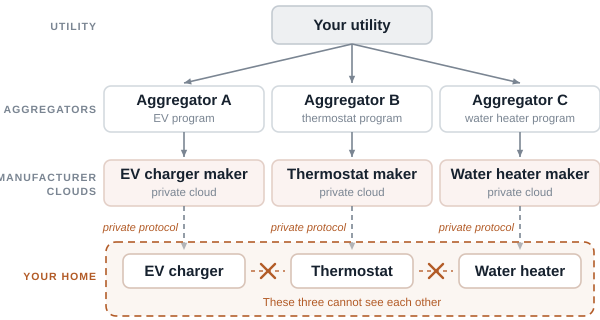
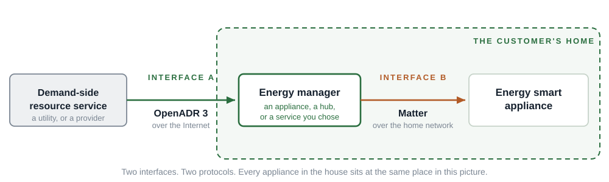
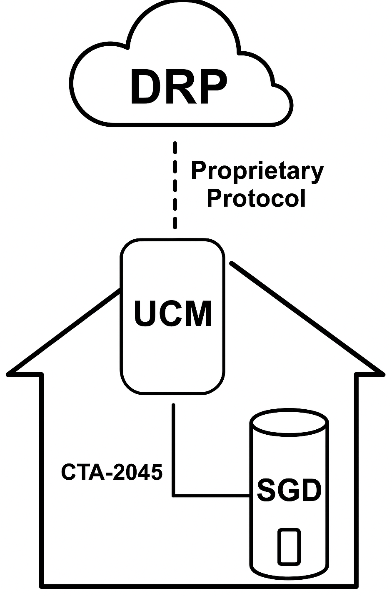
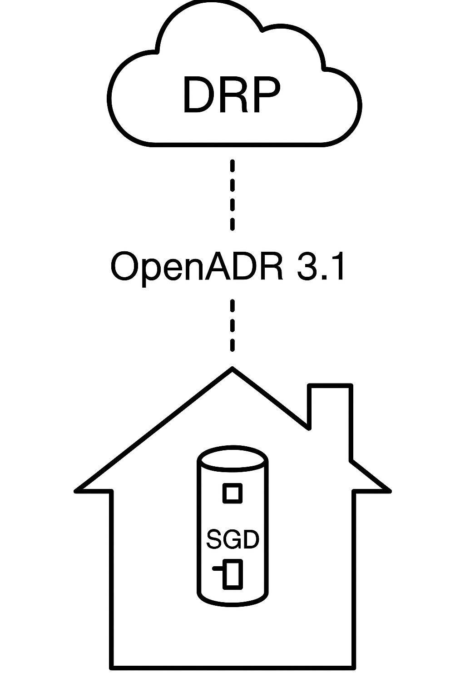
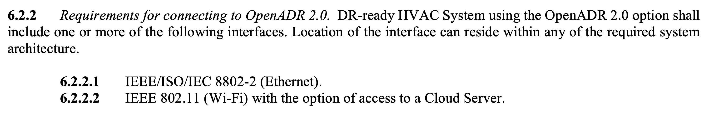
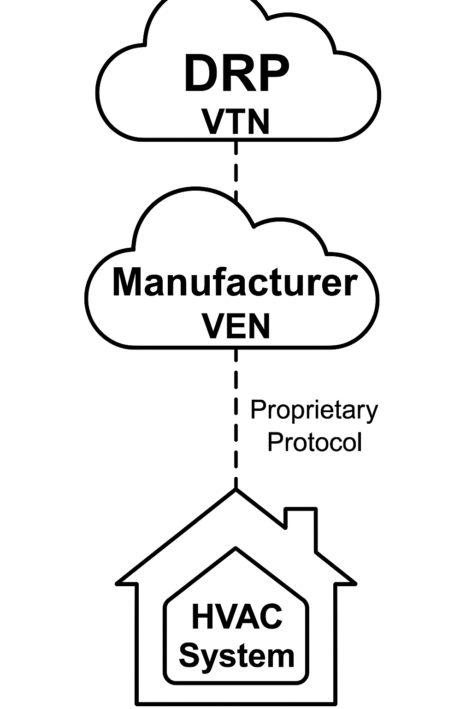
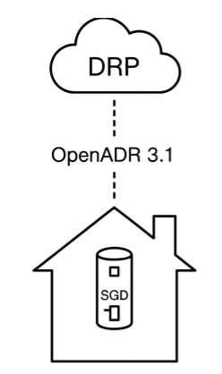
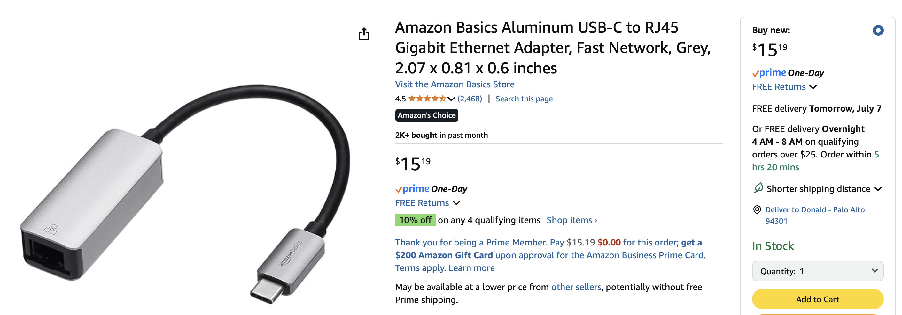
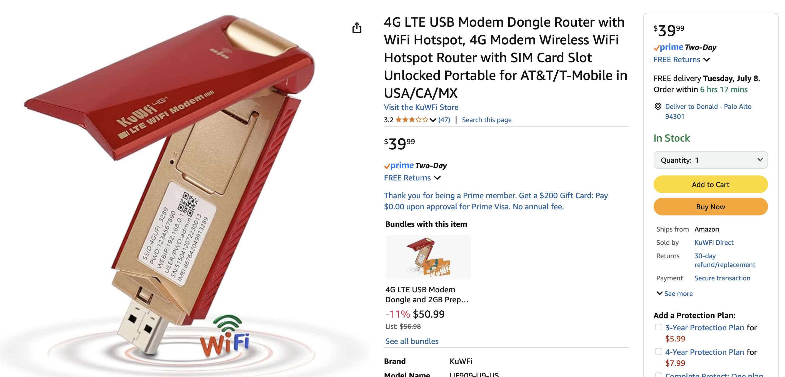
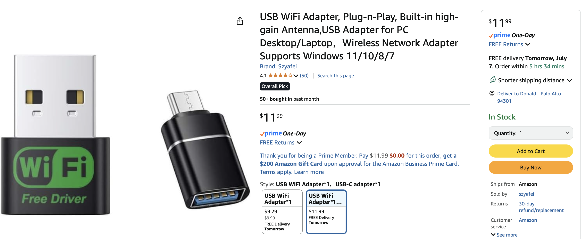

<!-- _class: alt -->
<!-- _paginate: false -->
<!-- _footer: "" -->

### Flexible Demand Coordination and Interoperability

# Two protocols, not one per appliance

**OpenADR 3** across the grid boundary. **Matter** inside the house.

Which standards can carry the two facts a house needs, which cannot, and what to write instead.

DC Jackson · grid-coordination.energy

**California is the worked example.** Earlier version: CEC Interoperability Working Group, July 2025.

---

## The grid has two problems, and they need two different signals

- **Balancing the grid is economics.** The answer is a highly dynamic price. That is the right answer to problem 1, and where a jurisdiction is moving toward it, it should be pursued harder, not hedged.
- **Protecting the wire to one house is physics.** The answer is a per-customer power limit on the whole service connection, import and export.
- **Price reduces capacity problems. It cannot eliminate them**, because the price is a system-wide number and the constraint is on one street.

Separable in policy and in technology. They meet in exactly one place: **the thing in the house that decides what runs.**

---

<!-- _class: dense -->

## The two signals, as objects on the wire

| | A dynamic price | A per-customer power limit |
| --- | --- | --- |
| **What it is** | What power costs now, and over the coming hours | How much power this connection may draw, import and export |
| **Unit** | The whole system | One service connection |
| **The instrument** | A tariff. It prices energy | A condition on the service connection. It prices nothing |
| **Shape on the wire** | An interval: start, duration, typed value | **An interval: start, duration, typed value** |
| **Horizon** | Hours ahead, advisory | Hours ahead advisory, binding at the moment it applies |
| **Who may originate it** | A seller of electricity, an aggregator, or the house itself | The distribution operator, for that connection only |
| **Who enforces it** | Nothing. The house decides | A UL 3141 listed power control system |
| **Failure mode** | Somebody loses money | Somebody's transformer fails |
| **Trust model** | A public number anyone may read | A per-customer value, authenticated, enforced locally |

**Same shape on the wire is why this is one protocol problem and not two. Different failure modes are why it is still two signals**, which cannot share a trust model or an enforcement point.

**A time-of-use rate is a price stream with fewer changes. A flat rate is one with none.** Same mechanism, same appliance, whatever tariff the customer is on. **The appliance never needs a tariff engine, only an interval consumer.**

---

<!-- _class: dense2 -->

### The second signal, inside the house

## Only two things in the house need to know the limit

> Everything gets the price. Two things get the limit. One thing enforces it.

- **The UL 3141 listed power control system that enforces it.** Enforcement has to happen where the whole site's draw is visible. **A leaf node cannot enforce a site limit, because it cannot see the site.** NEC 705.13.
- **The energy manager that plans against it**, so the house schedules inside the envelope instead of colliding with it. The forward view is what lets it pre-heat the tank and stage the car rather than be surprised.
- **They can be the same device.**
- **No other appliance needs to know the limit exists.** Which collapses the whole appliance question into one: **can the price reach it?** **An appliance should be able to do either**: receive the price and decide for itself, or take a schedule from something in the house that has the price. **What fails is the manufacturer's cloud as the only path.**

**It must survive the network.** A house holding today's prices and today's limit keeps behaving correctly with no connection at all.

---

<!-- _class: dense2 tight -->

### How a signal reaches an appliance today

## The path that exists, and what it costs

- **Coordination runs through the manufacturer.** The customer cannot centrally manage devices from three manufacturers, cannot reach the power and energy APIs of equipment they own, and cannot coordinate anything with the Internet down, which is exactly when local coordination matters most.
- **It can be switched off.** On **October 25, 2025** Google ended cloud support for first and second generation Nest thermostats. Those homes lost every ability to respond to an outside signal, on a date the manufacturer chose.
- **Aggregators are legitimate, they do real work, and they should be fully supported.** **They must never be the only door.**

Every arrow is a commercial agreement somebody has to sign, maintain and renew, and it gets worse each time a household electrifies one more thing.

---

<!-- _class: dense -->

## Count the protocols in one all-electric house

| In the house | The protocol | US source | Price? | Connection limit? |
| --- | --- | --- | :--: | :--: |
| **EV charging equipment** | OCPP | CEC docket 24-FDAS-04, no rule text yet | No | No |
| **Electric water heater** | CTA-2045, marketed as EcoPort | Mandated in WA, OR, CO, NY | No | No |
| **Heat pump and air handler** | AHRI 1380 | Cited by utility programs and DR specifications | Only via the manufacturer's cloud | No |
| **Solar inverter, battery, bidirectional charger** | IEEE 2030.5, CSIP | California Rule 21 | In the spec, not offered to residential customers | Per inverter, not per connection |
| **Thermostat** | The manufacturer's cloud | CEC docket 24-FDAS-03, no rule text yet | Sometimes, at the vendor's discretion | No |
| **Pool pump control** | A clock, written into the rule | Title 20, 1693(b)(2)(C)(1), adopted | No | No |
| **Panel and power control system** | Nothing standardized | UL 3141 listing, NEC 705.13 | Not applicable | It enforces one. No standard way to send it one |

**Every row was a serious effort by serious people. Seven is still the wrong number.** Not one of them delivers both facts to the appliance. Five separate US rules produced them, and three more are open.

---

<!-- _class: dense -->

## And at scale, none of it is coordinating anything

| Function | Residential, at scale, today | California, 2026 |
| --- | --- | --- |
| **Highly dynamic prices** | Not available at scale. Pilots | Large IOUs owe an hourly, marginal cost-based rate by **Jan 1, 2027**; large CCAs by **Jul 1, 2027** |
| **Demand response events** | Proprietary, through the manufacturer's cloud to a DR provider | Unchanged |
| **Functional control of devices** | Proprietary, through the manufacturer's cloud to a VPP | Unchanged |
| **Grid alerts (FlexAlerts)** | To **people**, by TV, radio, SMS and app. Not to devices | Unchanged |
| **Distribution: per-device control** | Not available at scale. Pilots | Unchanged |
| **Distribution: per-site control** | Not available at scale. Pilots | **A tariffed flexible service connection**: PG&E and SCE to establish one, D.26-02-025 |
| **Customer-site capacity management** | Not available at scale | Load behind a **UL 3141 certified PCS** is excluded from the connected load calculation |

**Every entry in the middle column is a pilot, a proprietary cloud, or nothing at all.** The right column is real progress, and none of it yet reaches an appliance.

---

<!-- _class: dense -->

## Two facts, two boundaries, two protocols

> **The count of protocols should follow the count of boundaries, not the count of appliance categories.**

| Boundary | What has to cross it | The standard |
| --- | --- | --- |
| **Grid to house**, over the Internet | The price with a forward schedule, and the connection limit | **OpenADR 3** |
| **House to devices**, over the home network | The same two facts, to everything in the building | **Matter** |
| **At the service connection** | Enforcement of the limit | **UL 3141** listed PCS, NEC 705.13 |

**Any given appliance speaks exactly two protocols: one to the grid, one inside the house.** Every appliance in the house is wired to one electrical code, and nobody wrote a separate code for water heaters. **The signals that tell them what to do should arrive the same way. Nothing speaks four, and nothing needs a protocol named after itself.**

**This is less regulation, not more:** one capability written once, instead of a rulemaking per appliance forever, each going stale the day it is printed.

---
<!-- _class: dense2 -->

### The other boundary

## Inside the house, commands are fine

> **Across the grid boundary, objectives only. Inside the house the manager may command, because the customer owns it.**

- **The appliance says what it plans to do, and the manager reshapes the plan.** Start later, draw less, pause, resume. This is Matter's Device Energy Management, **a cluster that exists in the specification today.**
- **Every adjustment records who asked for it**, the house or the grid, and the record travels with the command.
- **So the customer can refuse the grid and keep local optimization.** No cloud-mediated program offers that choice.
- **And that setting cannot be changed over the network.** It changes on the device, by the person who owns it.

**One data model spans the whole house.** It already types EV charging equipment, water heating, space heating and cooling, battery storage, solar PV and pool pumps: **every appliance category California is writing a separate rule for.**

---

<!-- _class: tight -->

### The same split, specified independently

## Two interfaces, already specified

The architecture of the **OpenADR 3 to Matter interworking reference specification**, published by geo in March 2025, sponsored by the UK Department of Energy Security and Net Zero and developed with OpenADR Alliance and Connectivity Standards Alliance **experts**. It is not an alliance work product: the specification recommends that a standards body adopt it. **The OpenADR Alliance and the Connectivity Standards Alliance have since entered a liaison agreement, which came after this work rather than producing it.**

> **Somebody else already wrote this architecture down. What is missing is not the specification. It is the requirement.**

---

<!-- _class: dense2 -->

### Interface A, over the Internet

## OpenADR 3 at the grid boundary

- **It carries both facts.** A price with a forward schedule and a per-customer import and export limit are the same object. **The limit is a payload type, not a new protocol.**
- **It is ordinary web technology.** HTTPS and TLS, JSON, OAuth 2 for authorization, MQTT for server-initiated push so a client behind a home router never has to poll.
- **It runs on hardware appliances already contain.** A full client has been implemented on an **ESP32 with integrated Wi-Fi, under $5 in quantity.** The customer already paid for that part.
- **The server address is a setting.** The same protocol reaches a manufacturer's server, a seller of electricity, an aggregator, or a server in the customer's own house. Nothing above it changes.
- **It is the only one of these standards designed for the utility-to-customer leg.**

I proposed and led the OpenADR Alliance working group that produced the push notification protocol adopted in 3.1.

---

<!-- _class: dense2 -->

## One object, two payload types

**Two OpenADR 3 event intervals. Same schema, same client, same parser.**

| One OpenADR 3 event interval | Carrying the price | Carrying the limit |
| --- | --- | --- |
| Start | 2026-09-01T18:00Z | 2026-09-01T18:00Z |
| Duration | one hour | one hour |
| **Payload type** | **PRICE** | **IMPORT_CAPACITY_LIMIT** |
| Value | 0.41 | 7.2 |

> **One field differs. Everything else is the same object.**

- **A client written for one is already a client for the other.** No second stack, no second certification, no second rulemaking.
- The registry also carries **EXPORT_CAPACITY_LIMIT**, the available and reservation capacity types, and pass-through types for CTA-2045.
- **This is what "one protocol crosses the grid boundary" actually means.** Not a claim about vendors. A claim about a schema.

---

<!-- _class: dense tight -->

### OpenADR 3.1.0 User Guide, section 8.10 Capacity Management

## The standard is ready. Nobody is sending it.

**IMPORT_CAPACITY_LIMIT**, verbatim from the event interval payload registry: "The maximum import level for **the site**." **The site is the whole service connection, not one inverter.**

| In the specification today | What it says |
| --- | --- |
| **8.10.1 Dynamic Operating Envelopes** | A schedule of site-level import and export capacity in kW, announced when a client connects. Intervals commonly days long, re-announceable at any time. CSIP-AUS is the cited precedent |
| **8.10.2 Dynamic Capacity Management** | A subscription, plus increases the customer can buy. The customer bids a reservation and a fee; the server publishes what is available and at what price |
| **Communications loss, and outage** | The client reverts to `IMPORT_CAPACITY_SUBSCRIPTION`, announced with an interval that could be years long. After a grid outage it disregards every existing limit and re-polls |

Section 8.10.2, drawing the same line this deck draws. "Because the capacity information is customer-specific, this is a program requiring authentication, not a tariff relationship as the underlying energy prices are for the same customer."

This has been in the standard since 3.1.0. Nothing needs to be invented. **What does not exist is any utility sending that envelope to a residential customer's own equipment.**

---

<!-- _class: dense tight scorecard -->

## Scorecard: does it carry the two facts, and how far does it reach?

| | OpenADR 3 | Matter | 2030.5 | CTA-2045 | AHRI 1380 | OCPP |
| --- | :--: | :--: | :--: | :--: | :--: | :--: |
| **A price, with a forward schedule** | ● | ○ *home* | ○ *spec* | | | ○ *spec* |
| **A per-customer connection limit** | ● | | ○ *unit* | | | ○ *unit* |
| **Reaches the appliance itself** | ● | ● | ○ *spec* | ○ *socket* | ○ *unimplemented* | ○ *spec* |
| **Server address is the customer's setting** | ● | ● | ○ *spec* | | | ○ *spec* |
| **Keeps working with the Internet down** | ● | ● | ○ *spec* | | | ○ *spec* |
| **Unit of management** | the connection, or any device | the appliance | one inverter | one appliance | one HVAC system | one charger |

● full. ○ partial, **and the tag says which kind**: *home*, works only once something in the house already has the signal. *spec*, in the specification, not offered to residential customers in the US. *unit*, it carries a limit, but not for the service connection. *socket*, it reaches the appliance, but only through a separately purchased module that speaks a proprietary protocol upstream. *unimplemented*, the standard permits it and no product implements it.

**Matter is local by construction**, so its mark on reaching the appliance is structural: a product that supports Matter supports it on the home network, because there is no cloud-mediated Matter. **AHRI 1380 permits exactly the same thing and no appliance implements it**, which is what the tag says.

**The blanks are deliberate.** Matter has no site object, so there is nothing in the data model to hold a connection limit. CTA-2045 and AHRI 1380 terminate in a vendor cloud, so with the Internet down nothing new arrives and no address is configurable.

**Enforcement is not a row on this table, because no protocol enforces a limit.** A UL 3141 listed power control system does. And four of these six were built to manage exactly one piece of equipment: an inverter, an appliance, an HVAC system, a charger. **A modern house has all four.**

---

<!-- _class: dense2 tight -->

### IEEE 2030.5

## Built to control inverters, not to manage a house

**Credit where it is due.** The usual smart inverter protocol: **California Rule 21 names it the default**, not the only one. SunSpec certifies implementations through authorized labs, and it does real distributed energy resource control.

- **The unit is one inverter.** A modern house has solar, a battery and one or two bidirectional chargers. Control each separately and **nobody is managing the total.**
- **CSIP does express export limits at a point of common coupling.** The unit available there is the inverter or the aggregate of inverters. **It is not the whole service connection including load**, which is what a transformer actually sees.
- **In US residential practice the customer is not in the path.** Manufacturers translate 2030.5 into proprietary commands or proxy it to their own client. No seller of electricity offers one a direct connection to its 2030.5 server.
- **And the identity model is why.** Every client needs an X.509 certificate the utility's PKI will accept. Reasonable for an inverter the utility answers for. **It structurally excludes a customer running their own client, or an open-source one.**

> **OpenADR 3 uses TLS with OAuth 2 client credentials, which is how a bank exposes your account to software you chose. Good enough to move money is good enough for a price and a limit.**

---

<!-- _class: dense2 tight -->

### OCPP

## Built for public charging, not for the home

- **It does public charging very well**, which is what it was designed for. It also specifies a great deal that a charger in a garage has no use for.
- **Almost no US residential chargers implement it.** Where it is supported, the connection is not offered to the customer: **it points at the vendor's cloud.**
- **What it does carry is aimed somewhere else.** Charging profiles impose a limit on the charger, not on the connection. Tariff and cost messages exist to show a driver a number, not to let a load plan against a schedule.
- **There is no need for a protocol unique to EV chargers.** A charger needs the same two facts as the water heater next to it.

**A charger rule is the rule most likely to name a charger-specific protocol**, for no better reason than that it is a charger rule. **CEC docket 24-FDAS-04 is open, no rule text yet, and there is no residential installed base to grandfather. Nothing is lost by leaving OCPP out.**

---

## The charger wants what the rest of the house already speaks

Nobody chose OCPP for the home. It was inherited from public charging infrastructure, where it earns its place. **A rule that names it makes the inheritance permanent.**

---
<!-- _class: tight -->

### The test worth more than any protocol comparison

## Enabled is not ensured

ENABLED

A port, and a promise that some other device will do the rest. **Success left to chance.**

ENSURED

An open protocol, a network interface, and a server address the owner can change. **The customer connects it, and it participates.**

---

<!-- _class: dense2 tight -->

### Mandated on new electric water heaters in four US states: WA, OR, CO and NY

## CTA-2045, marketed as EcoPort: the open interface stops at the socket

**Same appliance. Same DR provider. One of them has a $150 part, a proprietary link and an install visit.**

- **The socket is standardized. Nothing above it is.** Every vendor's module speaks its own language upstream, so two compliant water heaters need not interoperate, and neither is reachable by anyone but its module's vendor.
- **The module costs well over $150**, and the customer has to buy it, install it and configure it to Wi-Fi. In practice that has proven insurmountable.
- **It cannot carry a price.**
- **Its semantics are already expressible in OpenADR 3**, delivered to the appliance directly. **Nothing of consequence is lost by retiring it**, and the alliance is writing the mapping.

**Worse than neutral: mandating the port consumes the appliance's device-communications budget and precludes the better solution.**

---
<!-- _class: tight -->

## When the gap is too wide to jump

**CTA-2045 is the worked example.** Four US states mandated the port. The distance from the port to participation proved insurmountable, and the appliances did not participate.

---

<!-- _class: dense2 tight -->

### Section 6.2.2, in the standard's own words: two loopholes in three lines

## AHRI 1380: the interface may live anywhere, so it lives in a cloud

- **"shall include one or more of the following interfaces."** One is enough, so one is what ships.
- **"Location of the interface can reside within any of the required system architecture."** So the interface may live in the manufacturer's cloud, and it does. **It certifies the cloud, not the appliance.**
- The standard permits a local interface two ways: an OpenADR 2.0 connection over Ethernet or Wi-Fi, or a CTA-2045-A port. **In seven years no shipping product has implemented either on the equipment, and I know of no vendor planning to. At some point that stops being a lag and becomes a choice.**

**A standard that permits an open local interface, with nothing shipping that uses it, is the clearest evidence there is for writing capability as a requirement rather than an option.** The ask is not to ban AHRI 1380. It is: **do not accept the 2019 edition as evidence that an appliance has an open local interface.**

---

<!-- _class: dense2 -->

## What actually happens when the appliance is unboxed

- **Default, with no customer action at all:** the appliance ships with the manufacturer's server address preconfigured, joins the network, connects, and participates. **Out of the box it works, and nobody has to understand any of this.**
- **Before falling back to that default, it looks for a local energy manager over mDNS.** If one answers, it uses that instead. **A customer who owns an energy manager gets local coordination with zero configuration.**
- **At any time the customer can point it somewhere else:** their seller of electricity, an aggregator they chose, or their own energy manager. **One setting. One URL.**
- **One gap, and it is small.** OpenADR 3.1 defines local discovery: the service type `_openadr3._tcp.`, with `local_url`, `base_path`, `program_names` and `requires_auth` in the TXT record. **Every clause of it is a SHOULD.** A rule that expects an appliance to find a local energy manager has to say SHALL. **That is a one-word specification ask, not a rulemaking ask, and I will carry it.**

---

<!-- _class: dense2 -->

### All of Ethernet, Wi-Fi and cellular. Not one or more of.

## Network interfaces: the requirement that keeps getting softened

**"Must support Ethernet, Wi-Fi and cellular" is not a cost objection. It is a $5 objection.**

- **A garage with no usable Wi-Fi:** the customer, the installer or the DR provider adds a cellular dongle. **$39.99.**
- **A customer who wants wired reliability:** a USB-C to Gigabit Ethernet adapter. **$4.76.**
- **Write it so a vendor cannot satisfy it with a promise:** at least one integrated network interface, **plus a USB-C host port that accepts a class-compliant network adapter**. That is testable. "Capable of supporting" on its own is not.
- **AHRI 1380 is the worked example.** It says "one or more of the following interfaces," and what ships is one.

**Write "all three, integrated or over USB-C." Do not write "one or more of."**

---

### The energy manager

## The local price

An energy manager receives the grid price over OpenADR 3, then does one of two things.

- **Republishes it unchanged**, to every device in the house, over Matter.
- **Computes a local price** from the grid price, what the roof is generating right now, and what is stored in the battery and the cars. **The dishwasher then sees the true marginal cost of running in this house at this minute**, which is not the grid price and never was.

This is why the translation belongs in the house. **Only the house knows the car is already charged, that nobody is home, and that the battery is full.** No aggregator can compute this number, because no aggregator has the inputs.

**And the privacy comes free, instead of costing something.** Send a number instead of a command and the most intimate data in the house never leaves it.

**And it is the same interface either way.** The appliance sees an interval-valued price. It never knows or cares who computed it.

---

<!-- _class: dense -->

### The same argument, one layer up

## One standard, not one per appliance

**The first flexible demand appliance standard in the US is California's**, Title 20 sections 1690 to 1697, pool controls, in force for units built on or after September 29, 2025. **It is also the worked example of how not to do this.**

| | |
| --- | --- |
| **What it requires** | A preconfigured schedule: run 9 a.m. to 3 p.m., never automatically 4 p.m. to 9 p.m. (1693(b)(2)(C)(1)). Open standards for the **consent** functions only (1693(b)(6)(B)) |
| **What it cannot do** | Receive a price. Receive a limit. Receive anything at all, over any open protocol, from anybody the customer chooses |
| **Written the same way now** | Thermostats (24-FDAS-03), EV charging equipment (24-FDAS-04), home batteries (25-FDAS-01). Then water heaters, then whatever is next |

**Written one appliance at a time, the first one produced a clock.** An appliance built to it cannot receive a price, cannot respect a limit, and cannot be pointed at a server the customer chose. **It is the opposite of every principle in this deck, and it is the template for the next three rules unless something changes.**

**One standard, for every flexible demand appliance, stating the capability.** An appliance appendix only where the physics genuinely differs. **This is less regulation, not more.**

---

<!-- _class: dense -->

## Write the capability, not the standard

| Write this, in the rule | Not this |
| --- | --- |
| The appliance shall receive a price with a forward schedule and a connection limit over an open protocol, implemented in the appliance | "Shall support [named standard, 2019 edition]" |
| The server address shall be configurable by the owner without the manufacturer's participation | "The manufacturer shall provide a grid interface" |
| The appliance shall retain and act on the last received values with no network connection | Nothing, which is what most rules say about outages |
| At least one integrated network interface, plus a USB-C host port accepting a class-compliant network adapter | "One or more network interfaces" |
| A customer may take the signals directly, with no enrollment and no intermediary | "Customers participate through a program administrator" |
| One import and export limit for the service connection, enforced by a listed power control system | "Each inverter shall be controllable" |

**Name the standard in an appendix you can update without reopening the rule.** The rule states the performance requirement **and its test method**. The appendix lists the protocols staff have found to conform to that test method. **A new protocol is added by demonstrating conformance, not by reopening the requirement.**

---

<!-- _class: dense -->

## The same rule text, as bench tests

**A capability nobody can test is a capability nobody will adopt.** Appliance rules run on test methods, California's Title 20 included. **Each line is measurable on a bench in an afternoon, with no help from the manufacturer.**

| Capability | What the lab measures |
| --- | --- |
| **Open protocol in the appliance** | Point the appliance at a reference server on the bench. It connects and acts, with the manufacturer's cloud unreachable |
| **Customer-configurable server** | Change the server address using only the device's own interface, with no vendor account and no vendor app. Time it |
| **Both facts consumed** | Publish a price schedule and a connection limit. Observe the load change, and observe the forward plan change |
| **Local survival** | Deliver a schedule, then cut the WAN. The appliance keeps acting on the retained values for the full horizon |
| **All three interfaces** | Present Ethernet, Wi-Fi and cellular in turn, integrated or over USB-C. Each one reaches the configured server |
| **No enrollment** | Connect the appliance to a reference server with no account creation, no program enrollment and no intermediary. It receives and acts on both facts |
| **Site limit enforcement** | Drive the site above the limit. **The listed power control system holds the connection**, whatever any single appliance does |

**Only the last row needs a panel.** The first six are an appliance, a laptop, and a server anybody can run. **The reference server is public and free to point a device at.**

---

<!-- _class: dense2 tight tighter -->

## The asks

**Wherever appliance rules are open, the protocol count goes to two or to ten.** California has three open with no rule text: thermostats (24-FDAS-03), EV charging equipment (24-FDAS-04), home batteries (25-FDAS-01).

- **One flexible demand standard, not one per appliance.** State the capability once, for every appliance in scope.
- **Write the capability, not the clock, and not the protocol name.** The two facts, an open interface in the appliance, a configurable server address, local retention. Standards in an appendix, tied to a test method.
- **Do not accept a cloud interface as compliance.** AHRI 1380-2019 is the worked example: permitted locally, implemented by nobody.
- **Do not write a per-appliance protocol into a per-appliance rule.** No OCPP in the EVSE standard, no CTA-2045 in the water heater standard.
- **Say what happens to the limit.** Where a flexible service connection is ordered (D.26-02-025), the limit must reach the customer's own equipment in an open, machine-readable form, with no enrollment and no intermediary.
- **A signal nothing can find is not a signal.** California's hourly rate is due January 1, 2027; the tool that lets a device discover which rate a customer is on, not until May 8, 2029.

---

<!-- _class: dark -->

### Backup

## Detail

---

<!-- _class: dense -->

## Where California actually stands

| Driver | Where it stands |
| --- | --- |
| **Load Management Standards** | Large IOUs: an hourly, marginal cost-based rate for every customer class by **January 1, 2027**. Large CCAs: that rate or a qualifying program by **July 1, 2027**. The joint rate identification access tool has slipped to **May 8, 2029** |
| **Flexible service connections** | **D.26-02-025**, February 2026. PG&E and SCE to establish a standardized tariffed flexible connection. Load behind a **UL 3141 certified** power control system is excluded from the connected load calculation |
| **Appliance standards (FDAS)** | **One adopted**: pool controls. A preconfigured schedule (1693(b)(2)(C)(1)) and open standards for the **consent** functions (1693(b)(6)(B)), with no ability to receive a price, a signal or a limit, and no customer-configurable server. **Thermostats (24-FDAS-03), EV charging equipment (24-FDAS-04) and home batteries (25-FDAS-01) are pre-rulemaking with no rule text** |

---

<!-- _class: dense -->

## Commercial and grid-scale: how is this communicated today?

| Function | Commercial and grid-scale |
| --- | --- |
| **Highly dynamic prices** | Thin. Price servers exist, MIDAS in California. Neither is a path an appliance can rely on |
| **Demand response events** | OpenADR 2.0b, cloud to cloud. Some IEEE 2030.5 |
| **Functional control of devices** | IEEE 2030.5, **inverters only** |
| **Grid alerts** | No machine path |
| **Distribution: per-device control** | IEEE 2030.5, **inverters only** |
| **Distribution: per-site control** | Thin. IEEE 2030.5 where it exists at all |

> **This is the answer to "why not just use what commercial and grid-scale already use."** The one solid entry is inverters, the unit of management is wrong for a house, and 2.0b is a cloud-to-cloud protocol that was never meant to reach an appliance.

---

<!-- _class: dense2 -->

## OpenADR 3 on the wire

- **Objects:** programs, events with intervals, reports. An interval has a start, a duration and a typed value.
- **Transport:** HTTPS and TLS, JSON payloads, OAuth 2 client credentials for authorization.
- **Push:** MQTT, so a client behind a home router receives server-initiated notifications without polling. Added in 3.1.
- **Client footprint:** implemented on an **ESP32 with integrated Wi-Fi, under $5 in quantity.**
- **Same protocol, any server:** a manufacturer's, a seller of electricity, an aggregator, or one running in the customer's house.
- **A free public server is running now**, carrying real California prices and grid emissions, with client tutorials, no account and no enrollment.

---

<!-- _class: dense2 -->

## The Matter energy clusters, by name

- **Device Energy Management**, and **Device Energy Management Mode**: what a device plans to do, and the ability to shift that plan. The manager reads a `Forecast` and reshapes it with `PowerAdjustRequest`, `StartTimeAdjustRequest`, `ModifyForecastRequest`, `PauseRequest` and `ResumeRequest`. Each carries an `AdjustmentCause` of `LocalOptimization` or `GridOptimization`, and `OptOutState` is read-only over the network.
- **Energy EVSE**, and **Energy EVSE Mode.**
- **Water Heater Management**, and **Water Heater Mode.**
- **Thermostat.**
- **Electrical Power Measurement**, and **Electrical Energy Measurement.**

**These clusters exist in the specification today.** The commissioner is the customer's, so the fabric is the customer's.

**Do not pin a version number in rule text.** Name the clusters if you must name anything, and put editions in the appendix.

---

<!-- _class: dense2 -->

## Electrification Bus, and what else is in this layer

- **A different device population:** the panel, the meter, inverters, batteries, the microgrid interconnect device. **The homeowner pays for them, but does not install or commission them.** That is licensed work, under an electrical code (the NEC in the US) and an inspection. **Matter may well report their state and offer a customer sensible controls, and that is fine. What it will not do is the detailed interoperation between them.**
- **Today each one meters what it can and shares nothing.** Control paths run through vendor clouds that fail during exactly the outages when local coordination matters most, and every device-to-device integration is a bespoke project between two vendors.
- **What [Electrification Bus](https://ebus.energy) (eBus for short) defines:** how these devices discover each other, publish what they measure, and coordinate locally with no cloud in the loop. MQTT on the home network, Homie v5 semantics, mDNS discovery. Specification and reference work are public.
- **S2**, the European counterpart: complementary, not competing. It exchanges **flexibility patterns** rather than device commands, keeping the manufacturer in control of the appliance and the customer in control of the outcome. It sits at roughly the layer Matter's energy clusters occupy, not at the grid boundary. **Nothing in this deck changes if S2 wins inside the house.**

**eBus is my own proposal, and I wrote the specification.** It should be held to the same tests as everything else in this deck.

---

<!-- _class: dense -->

## Ensured, not enabled

| | **Ensured** | **Enabled** |
| --- | --- | --- |
| **What the appliance has** | An open protocol, a network interface, and a server address the owner can change | A connector, and a promise that some other device will do the rest |
| **What the customer does** | Connects it | Buys a module, installs it, configures it to Wi-Fi, and accepts whatever that module speaks upstream |
| **Cost to participate** | Zero | Well over $150, plus a truck roll or a frustrated homeowner |
| **Result** | It participates | It usually does not |

> **The gap between enabled and ensured is where every flexible demand mandate of the last decade has died.** Write the standard so that compliance means ensured.

---

<!-- _class: tight -->

### AHRI 1380

## What actually ships, and what could

The standard permits a local interface. **Everything on the left conforms to it, and that is exactly the problem:** a standard that permits the left-hand picture gets the left-hand picture, and so does any rule that accepts the 2019 edition as evidence.

**Today:** DR provider VTN, manufacturer VEN in the manufacturer's cloud, private protocol down to the equipment in the house. The house speaks nothing open.

**Instead:** the VEN in the equipment. Same DR provider, same standard family, one fewer party, and a server address the owner can change.

---

## The manufacturer's objection, and the answer

- **What they say:** the cost of the parts, and a ten-year support obligation on a device they no longer control.
- **The customer already bought the parts.** Every one of these appliances ships with a microcontroller and a Wi-Fi radio, on the customer's receipt. The customer still cannot talk to the thing they own without going through the manufacturer.
- **What the closed path actually protects:** the customer relationship, the customer's usage data, and a share of whatever that customer's load shifting earns.
- **A customer-configurable server reduces the obligation they say worries them.** They stop being the mandatory operator of a cloud service for the life of the appliance.

**The support burden is real, and it is answerable.** The claim on the customer's data, and on a share of what the customer's load shifting earns, is not a burden. **It is a business model.**

---
<!-- _class: tight -->

## What the partial marks are conceding

- **OCPP 2.1 defines tariff messages.** That is real and current, and it is why OCPP scores partial on price rather than blank. The unit of management is still one charger.
- **CSIP and IEEE 2030.5 can set an export limit at the point of common coupling.** Also real, and also why that cell is partial rather than blank. The limit governs the inverter rather than the service connection, and it is offered to a utility program rather than to a residential customer.
- **Both are conceded before they are raised.** Neither carries a price and a connection limit to every appliance in the house, over one open protocol, to a server the customer can point somewhere else. That is what the scorecard is scoring.

---

<!-- _class: dense2 -->

## Is a customer-configurable server a security problem? No.

- **It is a setting**, in the same sense that choosing an email provider is a setting. The manufacturer still ships a working default. What changes is that the default is not a lock.
- **The two signals have different risk profiles, and that is the whole answer.** Server choice affects the **price**, which is economic: a wrong price costs money. It does not affect the **limit**, which is enforced at the connection by the listed power control system regardless of what the customer configured.
- **The home can reject an implausible value locally**, which a direct-control architecture cannot do.
- **Today's arrangement is the larger attack surface:** dozens of vendor clouds, none subject to utility-grade review, each holding the ability to operate appliances inside homes.

**A price is a one-way number. A command is a key to somebody's house.**

---

## Machine-readable tariffs

> **The appliance should never need a tariff engine, only an interval consumer.** That requires the tariff to be published in a computable form.

- **The open [Utility Rate Plan Exchange (URPX)](https://lfenergy.org/projects/utility-rate-plan-exchange-urpx/) standard, hosted by LF Energy, is built for exactly this.** I contribute to it; it is an open standard, not a product.
- **A time-of-use rate is a price stream with fewer changes, and a flat rate is one with none.** Same mechanism, same appliance, whatever tariff the customer is on. Nothing waits for dynamic pricing to arrive.
- **And what to retire:** tariff attributes a price stream cannot carry. **A demand charge is the clearest example**, because it prices a peak after the fact, so no device can act on it from the signal alone.

---

<!-- _class: tight -->

### When a manufacturer disputes the cost

## Three interfaces, three listings, one USB-C port

Left to right: a USB-C to Gigabit Ethernet adapter at **$15.19**, an unlocked 4G LTE modem with a SIM slot at **$39.99**, and a USB Wi-Fi adapter at **$11.99**. All three are class-compliant, all three are ordinary retail listings, and all three plug into the same port. The cheapest Ethernet adapter on the main line is **$4.76**.

**The requirement was never a bill of materials.** At least one integrated network interface, plus a USB-C host port that accepts a class-compliant network adapter, and whoever needs that garage online supplies the adapter.

---

<!-- _class: dense -->

## Everything here is public and free

| | |
| --- | --- |
| **This deck** | grid-coordination.energy/presentations |
| **The price server**, with client tutorials | github.com/grid-coordination/price-server-user-guide |
| **Home Assistant integration**, in the HACS default repository | github.com/grid-coordination/openadr3-ven-hass |
| **Open-source libraries** (Clojure and Python) | github.com/grid-coordination |
| **eBus** | [ebus.energy](https://ebus.energy) |
| **CEC docket comments** and the California policy record | grid-coordination.energy/policy |
| **OpenADR 3** | openadr.org |
| **Matter** | csa-iot.org |
| **URPX**, machine-readable tariffs | lfenergy.org/projects/utility-rate-plan-exchange-urpx |

No account, no contract, no enrollment on any of it.

---

<!-- _class: dense -->

## The original protocol comparison matrix

| Criterion | IEEE 2030.5 | OCPP | CTA-2045 | AHRI 1380 | OpenADR 3.1 | Matter |
| --- | :--: | :--: | :--: | :--: | :--: | :--: |
| **Open standard** | ● | ● | ● | ● | ● | ● |
| **Dynamic pricing** | ○ | | | | ● | ● |
| **DR events** | ● | ○ | ○ | ○ | ● | ● |
| **Local control** | ○ | ○ | | | ● | ● |
| **Cloud-to-appliance** | | | | | ● | |
| **Customer-configurable server** | | | | | ● | |
| **Appliance-integrated** | | | ○ | | ● | ● |
| **Site power management** | | | | | ○ | ● |
| **All appliance types** | ○ | | | | ● | ● |

● full. ○ partial. **This is the earlier scoring, kept because it is the form the question usually arrives in.** The six-row scorecard on the main line is the current view, with every partial mark tagged and every blank justified.

