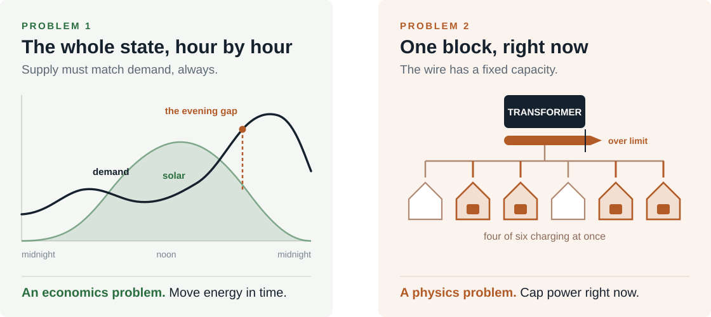
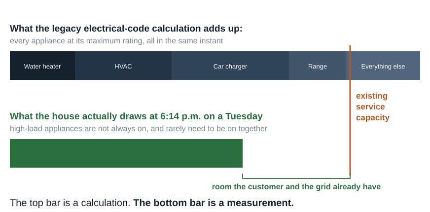
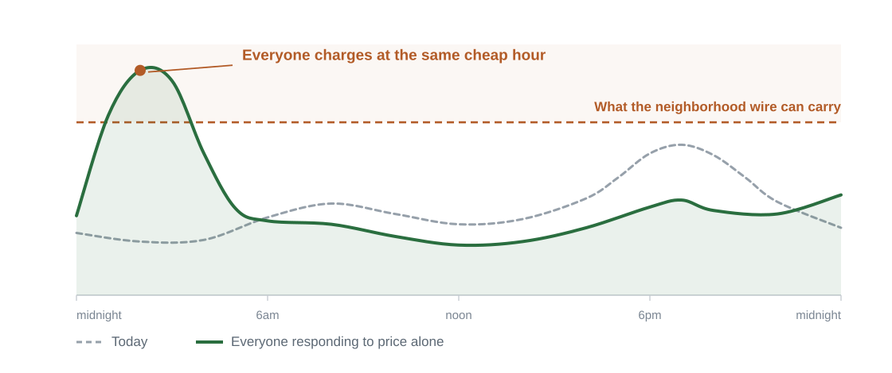
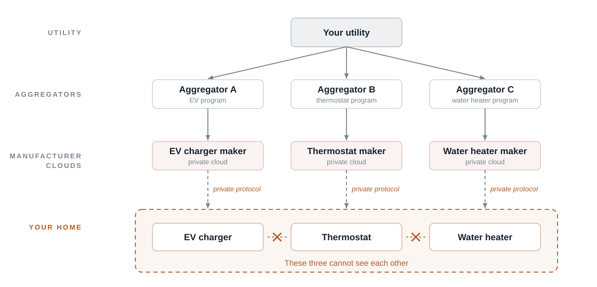
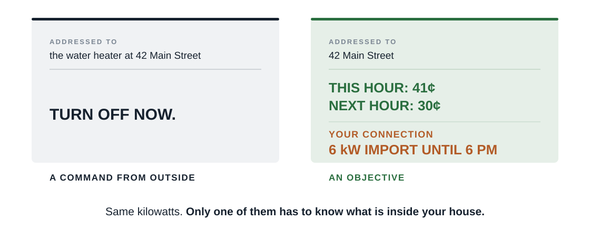
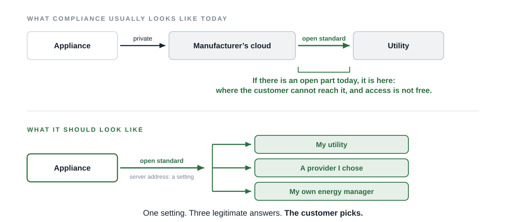
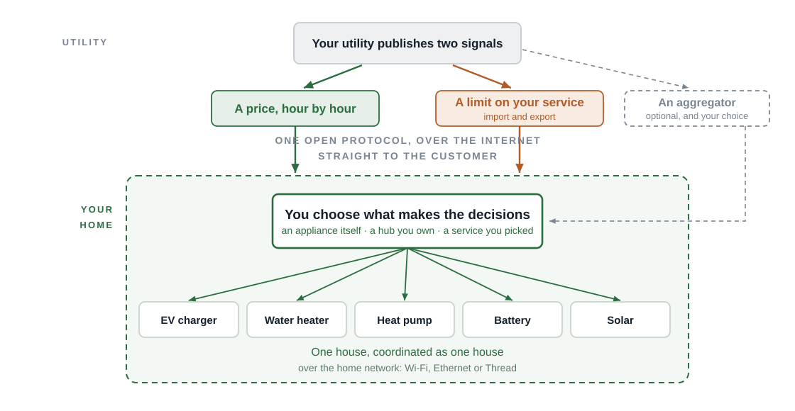

<!-- _class: alt -->
<!-- _paginate: false -->
<!-- _footer: "" -->

### Grid Coordination

# Two signals. Six tests.

The grid has two problems. Few proposals solve even one.

DC Jackson · grid-coordination.energy · August 2026

---

## The grid has two problems, and they are not the same problem

Balancing the state is an economics problem. Protecting the wire to a house is a physics problem. **Both land on the bill.** [Peak we cannot shift](https://www.utilizecoalition.org/untapped-grid) is generation and transmission somebody has to build; a transformer we cannot protect is a street somebody has to dig up. Ratepayers fund both.

---

## The current answer to problem 2 is a service upgrade

**We charge customers for a peak that does not happen, because we have no way to promise that it will not.**

---

## Price solves problem 1. It cannot see problem 2.

**Highly dynamic pricing is the right answer to problem 1, and the most important thing California is doing here.**

It should be pursued harder, not hedged. It just has no way to see the transformer, so it needs a companion that can.

---

## One signal cannot do both jobs

|  | A dynamic price | A per-customer power limit |
| --- | --- | --- |
| **What it is** | What energy costs right now | How much power this connection may draw right now |
| **What it protects** | Statewide supply and demand | The physical limit of one wire |
| **What it does** | Moves energy across time | Moves nothing. Caps power, immediately |
| **Without it** | Nobody has a reason to shift | Nothing stops everyone shifting at once |

Everyone in this room already lives with a power limit: it is the main breaker in your garage, and nobody has ever called it tyranny. The transformer on your street is the same device one size up, shared with five or six neighbors, except it has no breaker. It just cooks quietly for years, and then fails on the hottest day.

---

<!-- _class: tight -->

### The problem with aggregators and manufacturer clouds

## Four companies must agree before one water heater turns down

How can a customer's appliances and DERs be orchestrated when every one of them is controlled separately, and somewhere else?

And any of it can be switched off. On October 25, 2025 Google ended cloud support for first and second generation Nest thermostats: those homes lost every ability to respond to an outside signal, on a date the manufacturer chose.

---

<!-- _class: dark -->

### The Commission has already asked the question

> "What hardware, software, or data sharing safeguards may be needed to ensure that customers can obtain a flexible connection without being restricted by proprietary arrangements?"

Assigned Commissioner and ALJ ruling, July 7, 2026, seeking comment on the Assigned Commissioner's Proposal on Flexible Service Connections. Grid modernization rulemaking R.21-06-017, Question 8 to parties.

---

## Six tests for any flexibility proposal

Rate designs, appliance standards, virtual power plant programs, capacity and interconnection proposals. Every one of them will use the words <em>flexible</em>, <em>smart</em>, and <em>customer choice</em>. **Many of them also insert a new gatekeeper between the grid and the customer.**

1. Does the grid send the home **an objective**, or does it **operate the appliance**?
2. Does the open interface reach **the appliance itself**, or stop at **the manufacturer's cloud**?
3. Can the customer **point the appliance at a server of their own choosing**?
4. Can the customer take the signal **directly from their utility**, or is a **middleman required**?
5. Does the limit **hold at the customer's connection**, when the internet does not?
6. Does the customer **who cannot respond** end up better off, or worse?

---

## Test 1: send an objective, not a command

To be clear about which control is at issue: **a customer operating their own equipment, through a controller they chose, is exactly right.** What does not belong at the grid boundary is a grid party or a manufacturer holding that control instead.

PASSES an hourly price and a connection limit, published to everyone.
FAILS a program that needs the ability to command a named appliance in a named house.

---

## Tests 2, 3 and 4: open all the way to the appliance

PASSES the server address is a setting the owner can change, and a tariff any customer can take without a third party.
FAILS an appliance that meets the standard only through a cloud the manufacturer can switch off.

---

## Test 5: a bound, not a hope

#### Advisory to the home

Sent ahead, with a forward view, so the house can plan: pre-heat the tank, stage the car, surprise nobody.

#### Enforced at the connection

So it binds. A planner can count it, rather than hoping enough customers respond.

- **One customer, one connection, one limit** (import and export). A modern home has solar, a battery, one or two car chargers, a heat pump and a heat pump water heater, all at once. The limit belongs on the wire, not on any one appliance.
- **It must survive the network.** A home that already has today's prices and today's limit keeps behaving correctly with no connection at all.

PASSES a limit for the whole service connection, retained and acted on locally.
FAILS a rule written for one device category that ignores the other five in the same house.

---

## Test 6: the customer who cannot respond

The first objection to hourly prices and per-customer limits is that the affluent optimize and everybody else gets rationed. It is the right question and it deserves the first answer, not the last.

| | To join a program today | To read a public signal |
| --- | --- | --- |
| **An enrollment** | Required | Nothing |
| **A credit relationship with a third party** | Required | Nothing |
| **A particular brand of device** | Usually | Any device that can reach the network |

- **Nobody should have to watch a price.** The appliance watches the price. The customer sets a preference once.
- **The customers who cannot shift are paying today** for a grid sized to everyone else's worst hour. Capital spending that never enters rates is their benefit, and it is the largest one.

---

## The same house, with the door open

**Half of this is already running.** A [free, public server](https://github.com/grid-coordination/price-server-user-guide) carries real hourly California prices and grid emissions on an open standard, and [free open-source home automation software](https://github.com/grid-coordination/openadr3-ven-hass) receives it and orchestrates the household's loads against it. No account, no contract, no enrollment. [PG&E is piloting the other half with AMI 2.0](https://www.canarymedia.com/articles/utilities/as-californians-electrify-tech-prevent-grid-overload) (HomeBoost and PanelBoost).

---

## What not to mandate

| If the rule says | What you will actually get |
| --- | --- |
| "Must support [named standard, 2019 edition]" | Compliance frozen at the state of the art in 2019, and a vendor incentive to do nothing further |
| "The manufacturer shall provide a grid interface" | A cloud interface. The appliance still speaks nothing open, and it dies when that cloud does |
| "Customers participate through a program administrator" | Every customer needs a third party's permission before they can help the grid |
| "Each inverter shall be controllable" | Five separate control paths into one house and nobody managing the total |
| "The appliance shall run between 9 a.m. and 3 p.m." | A load shape frozen into regulation. It cannot follow a price, cannot respect a limit, and cannot change when the grid does |

**Name the capability in the rule, and the standard in an appendix you can update without reopening the rule.** Write it at the appliance, not at somebody's server.

---

<!-- _class: dense -->

### Pool controls, adopted 2023, the first in the nation

## The rule wrote the answer, not the capability

| The six tests | Pool controls, Title 20 sections 1690 to 1697 |
| --- | --- |
| **1. An objective, not operation** | **No objective is sent at all.** The rule fixes the hours instead: 9 a.m. to 3 p.m., nothing automatic 4 to 9 p.m. (1693(b)(2)(C)(1)) |
| **2. Open to the appliance** | **Partial.** Open standards are required, for the **consent** functions only (1693(b)(6)(B)) |
| **3. A server the customer chooses** | **Not addressed** |
| **4. Direct from the utility** | **Not addressed.** A vendor-exclusive, cloud-only design complies |
| **5. A limit that holds locally** | **No limit of any kind**, and no way to receive one |
| **6. The customer who cannot respond** | **The only one it answers**, by brute force, while those remain the right hours |

A fixed clock cannot tell a house importing from a strained grid at 6 p.m. from a house running its pump off its own battery at 6 p.m. **It treats them identically.**

**The three still open have no proposed rule text yet.** That is where to write the capability instead of the clock.

---

<!-- _class: dense2 tight -->

### Flexible Demand Appliance Standards

## FDAS should be one standard for all appliances, not one per appliance

We do not need OCPP for chargers, CTA-2045 for water heaters, AHRI 1380 for HVAC and IEEE 2030.5 for inverters: a protocol per appliance category, and a rulemaking behind each.

- **Every one of them needs the same two facts, and only those two.** What power costs now and next, and how much this connection may draw. A water heater does not need a water heater vocabulary to know either one.
- **Grid to house, over the Internet.** One open protocol carrying both, with the server address a setting the customer controls. **OpenADR 3 does this today.**
- **House to appliance, over the home network.** The same two facts to every device in the building, whatever it is. **Matter does this today.**
- **This is less regulation, not more.** One capability written once, instead of a rulemaking per appliance forever, each going stale the day it is printed.

Every appliance in the house is wired to one electrical code. Nobody wrote a separate code for water heaters, and the signals that tell them what to do should arrive the same way.

---

<!-- _class: alt -->
<!-- _paginate: false -->

### Backup

# Detail

---

<!-- _class: dense2 -->

### Making the price signal reach every customer

## A time-of-use rate is a price stream with fewer changes

- **The signal carries what power costs now and over the coming hours.** A schedule, not a single number. That forward view is what lets a house plan ahead.
- **Highly dynamic pricing is the destination, and nothing has to wait for it.** A flat rate is a price stream with no changes at all. Same mechanism, same appliance, same software, whatever tariff the customer is on. The appliance never needs a tariff engine, only an interval consumer.
- **What that asks of the Commission:** require tariffs to be published in a machine-readable, computable form. The open **[Utility Rate Plan Exchange (URPX)](https://lfenergy.org/projects/utility-rate-plan-exchange-urpx/)** standard, hosted by LF Energy, is built for exactly this.
- **And what it asks the Commission to retire:** tariff attributes a price stream cannot carry. A **demand charge** is the clearest example: it prices a peak after the fact, so no device can act on it from the signal alone.

Every customer can be served by the same mechanism today, whatever tariff they are on. The rate can get more dynamic later without touching a single appliance.

---

## Three levers, three proceedings, all already open

#### CPUC

Attach an open-access condition to the flexible service connection ordered in **D.26-02-025**: the limit must reach the customer in an open, machine-readable form, with no enrollment and no intermediary.

Extend the standard offer beyond PG&E and SCE.

Require tariffs published machine-readable and computable, so **any** rate becomes a price stream.

#### CEC

**The one adopted standard writes the answer into the rule.** Pool controls must ship a schedule running 9 a.m. to 3 p.m., never automatically 4 p.m. to 9 p.m. Nothing requires them to receive a price, a signal, or a limit over an open protocol, on the Internet or the home network.

Thermostats, EV charging and home batteries are still open. Make tests 2, 3 and 5 explicit there.

#### The Legislature

**AB 1787** is held in Senate Appropriations. It has been carried once, so it can be carried again, and it is one clause short: it gives the customer access to their **data**. Add access to the signals, and the right to point their own equipment at a server of their choosing.

The ask

**None of this needs a new proceeding. It needs one sentence in the ones you already have open.** Tell me which, and I will draft it and file it this month, at no charge.

---

<!-- _class: dense -->

## Where California actually stands

| Driver | Where it stands |
| --- | --- |
| **CalFUSE** | CPUC staff framework, June 2022, for a single universally available dynamic price signal. A white paper name, not a decision or a program |
| **Load Management Standards** | Large IOUs: an hourly, marginal cost-based rate for every customer class by January 1, 2027. Large CCAs: that rate or a qualifying program by July 1, 2027 |
| **Rate design** | D.25-08-049, August 2025. Guidelines for designing demand flexibility rates; the rates themselves are still in testimony. Remaining issues moved to R.26-04-009, opened April 2026 |
| **Flexible service connections** | D.26-02-025, February 10, 2026. PG&E and SCE to establish a standardized tariffed flexible connection. Load behind a certified power control system is excluded from the connected load calculation |
| **Appliance standards** | One adopted: pool controls, September 29, 2025. It mandates a preconfigured schedule (1693(b)(2)(C)(1)) and open standards for the **consent** functions (1693(b)(6)(B)), but no ability to receive a price, a signal or a limit, and no customer-configurable server. Thermostats, EV charging and home batteries are open dockets with no rule text |
| **Legislation** | AB 1787 held under submission in Senate Appropriations, August 13, 2026. The regulators are moving; the statute is not |

---

<!-- _class: dense2 -->

## Why some standards are hurting, not helping

- **CTA-2045, marketed as EcoPort.** Washington, Oregon, Colorado and New York require the socket on new electric water heaters. Nothing above it was ever standardized, so every vendor's module speaks its own language upstream, and the module a customer has to buy and install runs well over $150. **The open interface stops at the socket. The standard is obsolete and should be retired, not written into new rules.**
- **AHRI 1380.** The standard permits local interfaces over Ethernet or CTA-2045-A. **No shipping product implements either.** Vendors satisfy it by routing the equipment through their own cloud over a private protocol, so it certifies the cloud, not the appliance.
- **IEEE 2030.5.** Strong at commanding one inverter. But one inverter is the wrong unit for a house with solar, a battery and two bidirectional chargers: control each separately and nobody manages the total. **What belongs there is one import and export limit for the whole connection.**
- **OCPP.** Built for commercial and public EV charging. **Almost no** US residential chargers implement it, and where it is supported the connection is not offered to the customer: it points at the vendor cloud. **There is no need for a protocol unique to EV chargers.**

**Two open standards already support every one of these principles, and both ship today.**

**[OpenADR 3](https://www.openadr.org/)** carries prices, events and limits from the utility to the customer's own equipment, **over the Internet**. The server address is the customer's setting.

**[Matter](https://csa-iot.org/all-solutions/matter/)** carries the same information to every device inside the house, **over the home network**.

---

<!-- _class: dense2 -->

## The manufacturer's real objection, and the answer

- **What they say:** the cost of the parts, and a ten-year support obligation on a device they no longer control.
- **The customer already paid for the parts.** Every one of these appliances ships with a microcontroller and a Wi-Fi radio, on the customer's receipt. The customer still cannot talk to the thing they bought without going through the manufacturer.
- **What the closed path actually protects:** the customer relationship, the customer's usage data, and a share of whatever that customer's load shifting earns.
- **None of those three are theirs.** The usage data is private, and it belongs to the customer. The incentive is paid for the customer's forbearance, not for the manufacturer's software. And a customer-configurable server **reduces** the obligation they say worries them: they stop being the mandatory operator of a cloud service for the life of the appliance.

The hard part was never the technology. It is that nobody is required to open the door.

---

## Is a customer-configurable server a security hole? No.

- **It is a setting**, in the same sense that choosing an email provider is a setting. The manufacturer still ships a working default. What changes is that the default is not a lock.
- **The two signals have different risk profiles**, and that is the whole answer. Server choice affects **price** response, which is economic: a wrong price costs money, not safety. It does not affect the **limit**, which is enforced at the connection independently of anything the customer configured.
- **Today's arrangement is the larger attack surface**: dozens of vendor clouds, none subject to utility-grade review, each holding the ability to operate appliances inside homes directly.

A price is a one-way number. A command is a key to somebody's house.

---

<!-- _class: dense2 -->

### Everything here is public and free

## Where to find all of this

| | |
| --- | --- |
| **This deck, and the one-page handout** | grid-coordination.energy/presentations |
| **The price server**, with client tutorials | github.com/grid-coordination/price-server-user-guide |
| **Home Assistant integration**, in the HACS default repository | github.com/grid-coordination/openadr3-ven-hass |
| **Open-source libraries** (Clojure and Python) | github.com/grid-coordination |
| **My CEC docket comments** and the California policy record | grid-coordination.energy/policy |
| **OpenADR 3**, the grid-to-customer standard | openadr.org |
| **Matter**, the in-home standard | csa-iot.org |
| **URPX**, machine-readable tariffs, hosted by LF Energy | lfenergy.org/projects/utility-rate-plan-exchange-urpx |

No account, no contract, no enrollment on any of it. Every link in this deck is live and clickable in the PDF.

