# Whole-Home Electrification Project

**Palo Alto, CA**

DC Jackson

---

# About Me

- Silicon Valley systems/software/hardware developer, semi-retired
- Highly technical and hands-on, still writing code
- Home automation enthusiast
- Technology policy interests: energy, electrification, grid modernization

### Motivations

- Always wanted rooftop solar — grid-tied seemed incomplete, BESSes and EVs started getting good
- Gen-Z daughter very concerned about sustainability — urged us to "do better"
- Appointed to Utilities Advisory Commission, learned that natural gas is **bad**
- As a strong advocate for electrification, I believe in **practicing what I encourage others to do**

---

# Starting Condition

- Purchased in 2015
- Needed a new roof
- Aging HVAC and water heater
- Kitchen appliances: functional but dated
- Electric service: **200A**, main and sub panels
- Second floor uncomfortably hot in summer, A/C ineffective
- Three ICE vehicles

---

# Goals

- **Replace all gas appliances** with electric, disconnect from gas utility
- **Support EV charging** (potentially 2 EVs)
- **Resilience during grid outages**: rooftop solar (NOT grid-tied) + battery backup
- We plan to live here "forever" — quality of life and future-proofing outweighed budget concerns
- **Demonstrate** how a fully electrified home can actively participate in a dynamic, flexible grid
- Create a **real-world example** of smart load management, storage, and automation
- Become a working **laboratory** for energy and power management based on dynamic price, grid conditions, and household needs

---

# Design Process

- Installed networked multi-circuit electric meter to **measure existing use**
- NEC load calculations are insanely conservative — a major obstacle to electrification
- Concluded whole-home backup better/more future-proof than partial-home
- Configurable & automated load-shedding during outages highly desirable
- Roughly **2+ years** of research and planning

---

# Pre-Electrification Baseline (2020)

### Consumption history
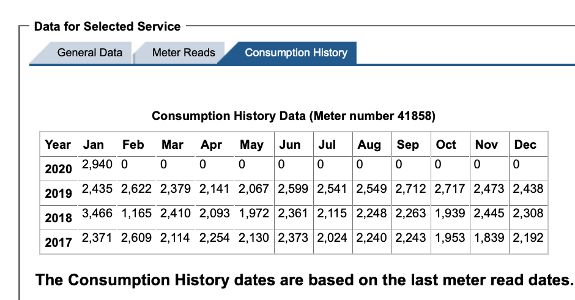

### Average daily
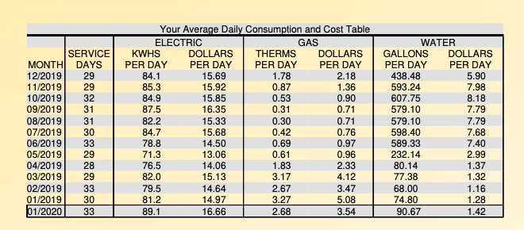

### Utility meter reads
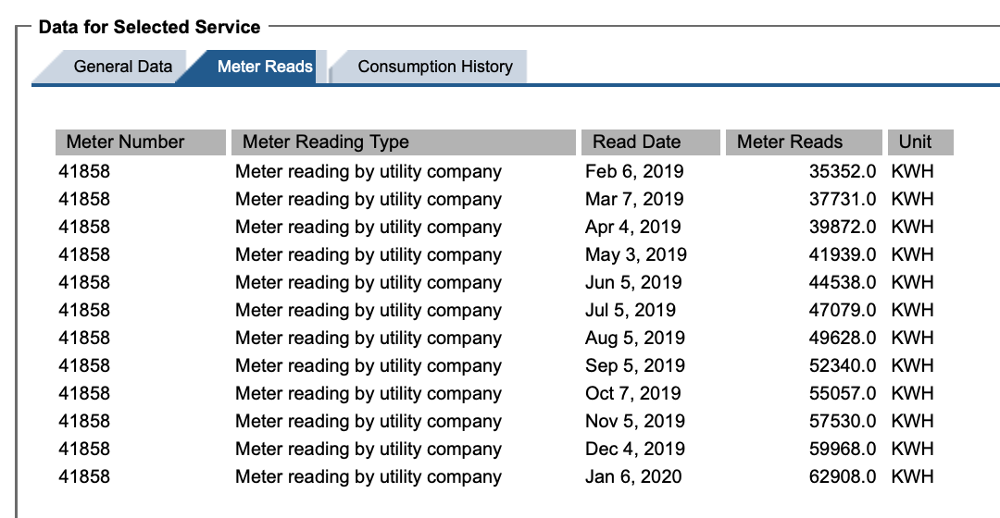

**Utility data + networked sub-metering established our real baseline — not NEC worst-case.**

---

# Design Decisions

| Component | Choice |
|-----------|--------|
| **Roof** | Standing-seam metal, replacing aging Hardie-shake |
| **Insulation** | 2.5" solid foam under roof + new attic insulation |
| **HP Water Heater** | Rheem 50 gal, 240 VAC, 30A |
| **HP HVAC** | Lennox variable-speed, multi-zoned |
| **Solar PV** | LG 400W panels, Enphase microinverters, rail-less mount |
| **Battery** | Tesla Powerwall 2 (three units) |
| **Cooktop** | 50A induction hob |
| **Panels** | Two SPAN smart panels in series |
| **EV + EVSE** | Tesla Model Y + Wall Connector (Level 2, 60A) |

---

<!-- _class: "" -->

# Before & After: Service Entrance

### Before

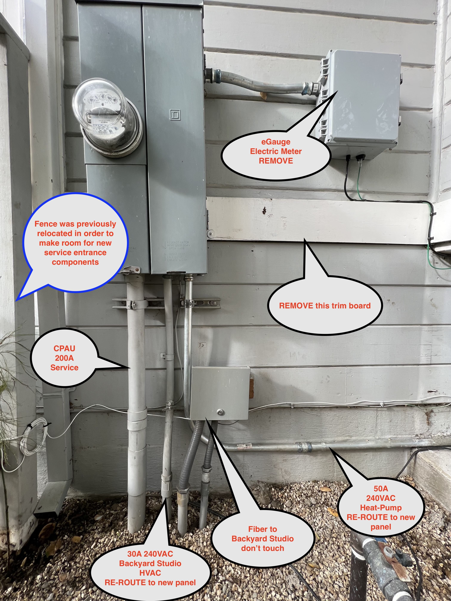

200A service, marked up for re-route

### After

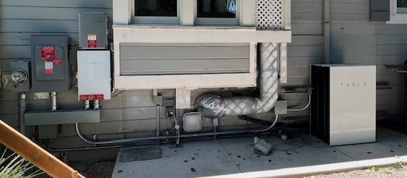

New panels + Tesla Powerwall

---

# SPAN Smart Electric Panels

- Home automation and energy management systems
- Real-time power monitoring of each circuit
- Controllable relay on each circuit
- Configurable automated load-shedding during outages

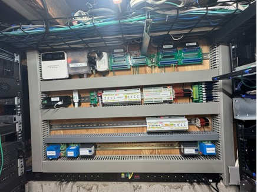

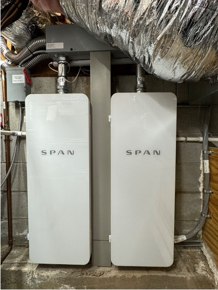
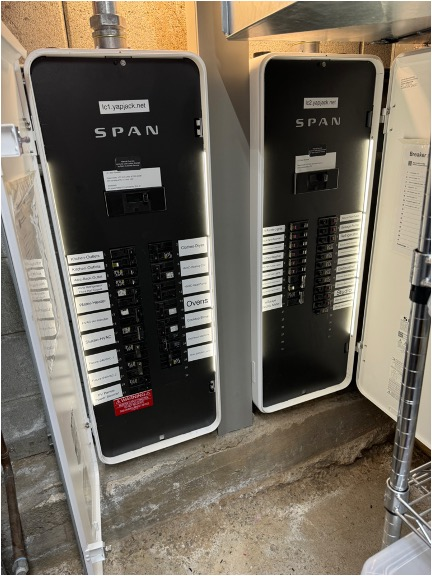

---

# Before & After: HVAC and Water Heater

### Before
Aging gas furnace and gas water heater

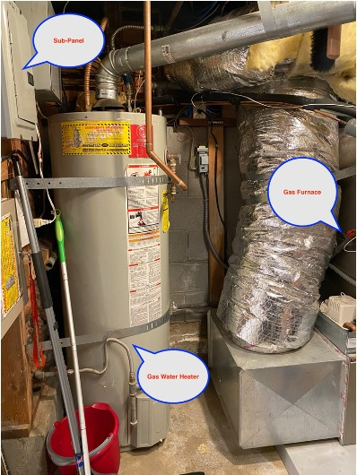 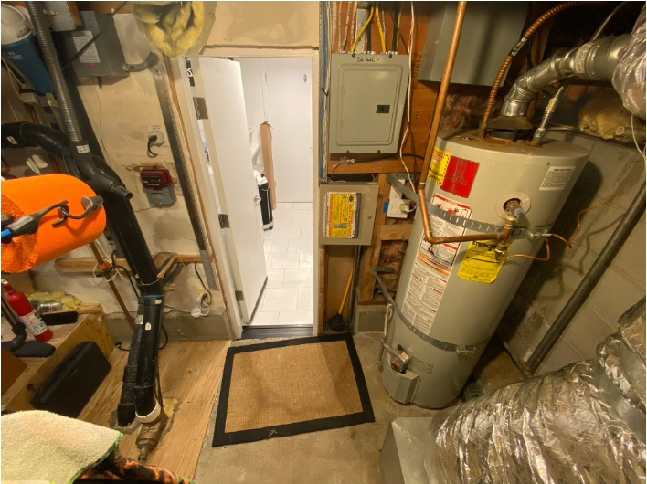

### After
Rheem HP-WH (50 gal, 240V) + Lennox variable-speed HP-HVAC, multi-zoned

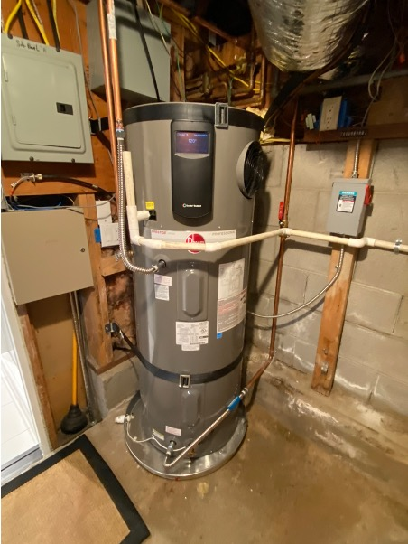 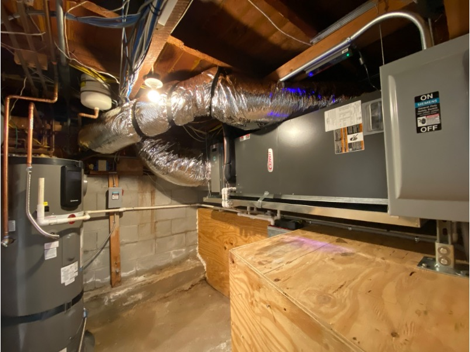

---

# New Roof and PV Panels

- Standing-seam metal roof with S-5! PVKIT rail-less mount
- LG 400W panels with Enphase microinverters
- Conduit from rooftops to service entrance routed through former furnace/WH flue

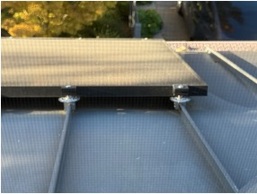 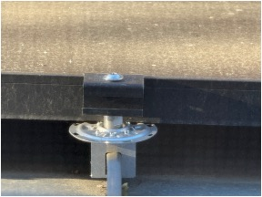

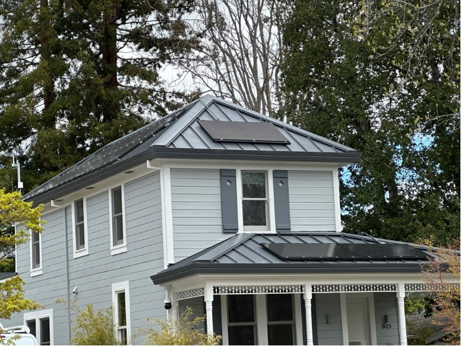
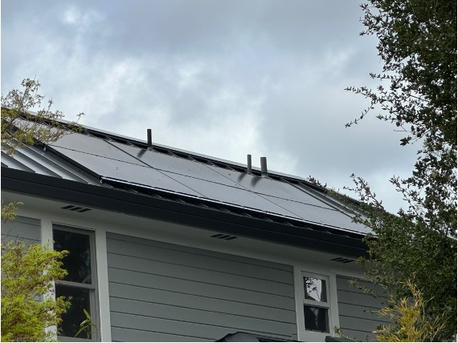

---

# EV Charging (EVSE)

- Tesla Wall Connector, Level 2, 60A
- Installed in garage for primary EV
- Capacity allocated via SPAN smart panel

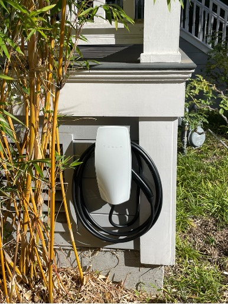 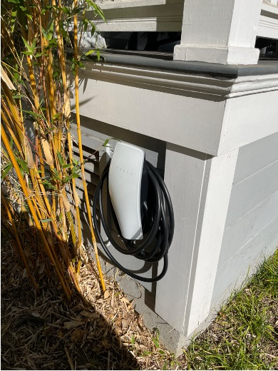

---

# Induction Cooktop

### Before (gas)

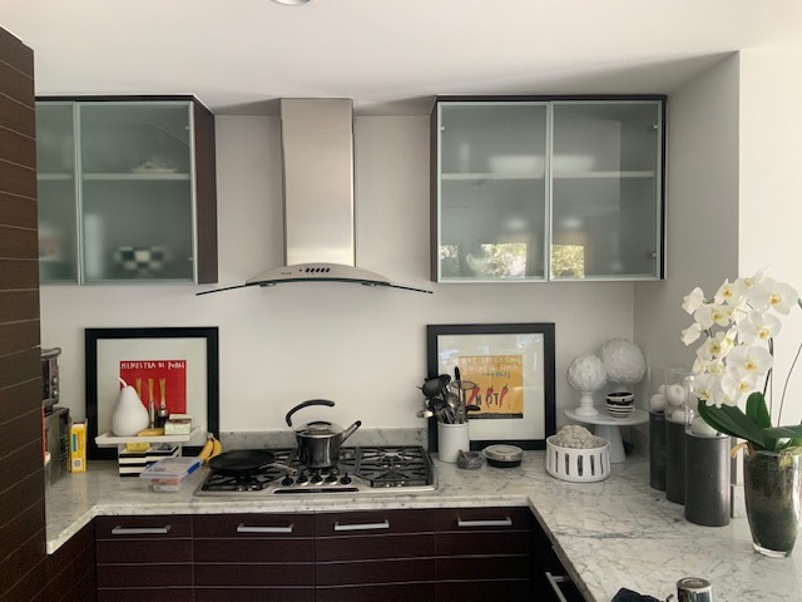

### After (induction)

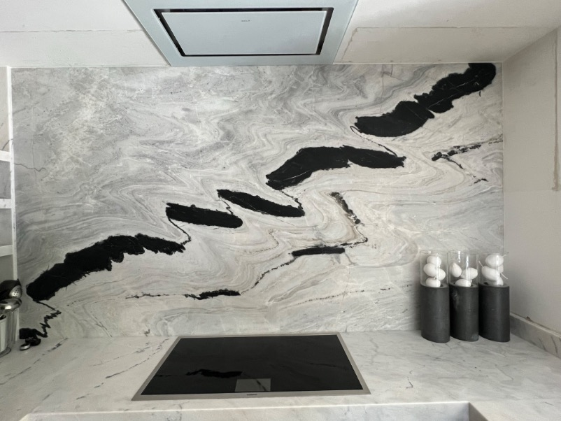

- 50A induction cooktop in same location as gas
- Moderate kitchen remodel: new countertop, backsplash, new appliances, kept cabinets
- Moved ventilation hood into ceiling — no gas fumes to exhaust!

---

# Disconnecting from Gas

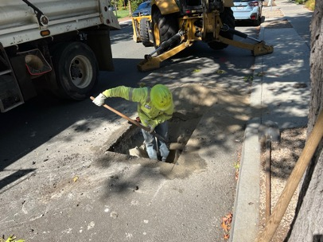
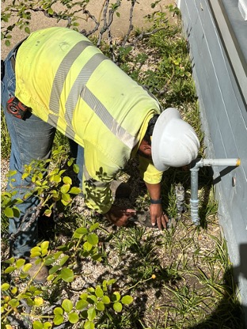

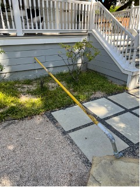
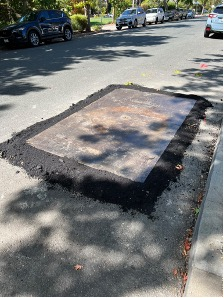

Meter removal, pipe capping, final disconnection from the gas utility.

---

# Data: Monthly Grid Consumption

### Pre-electrification: ~2000 kWh/month
### Post-electrification: ~2500 kWh/month

But grid consumption actually **decreased** — from ~2500 to ~2000 kWh from grid.

The difference: **~750 kWh/month of PV generation**

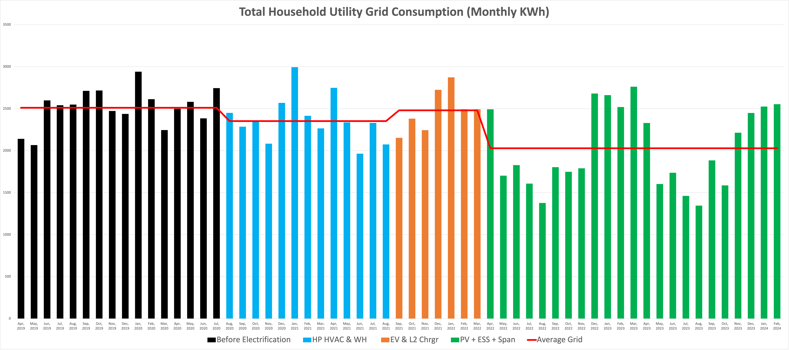

---

# Data: Monthly Total Consumption (Grid + PV)

### Total consumption: ~2750 kWh/month

- Using ~250 kWh **more** electricity than pre-electrification
- But ~500 kWh **less** from the grid
- PV generation makes up the difference: ~750 kWh

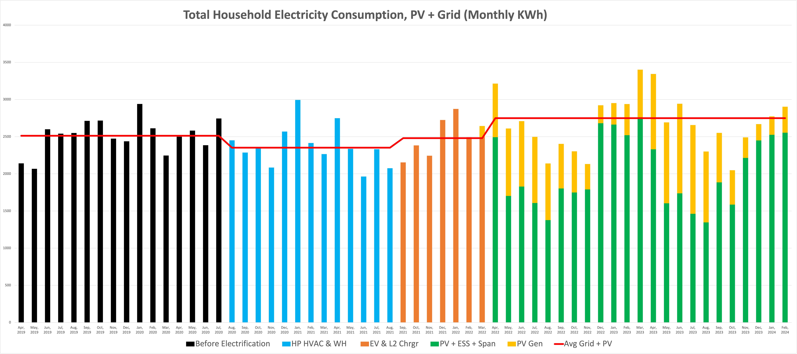

---

# Data: Instantaneous Grid Consumption

- Large baseline load of **~3 kW** with occasional large spikes/peaks
- (Mini "data center" in the basement!)
- Peaks of **15-20 kW** for a few hours — EV charging + cooking or dryer

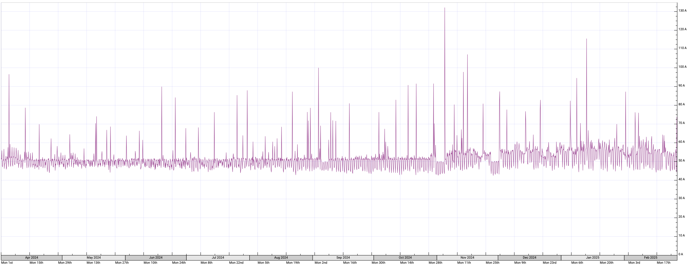

---

# Data: Peak Usage Event (Zoom)

A typical peak: EV charging overlapped with cooking and dryer.

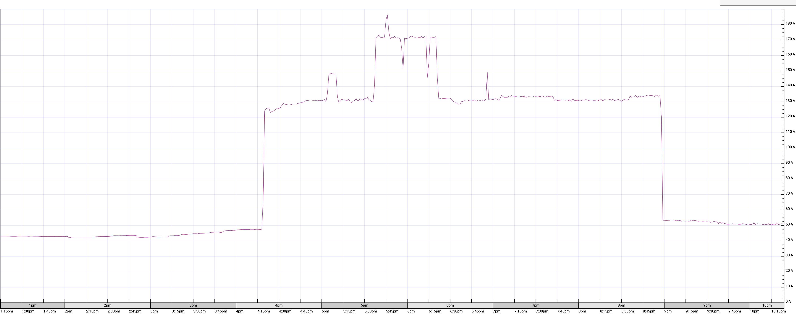

---

# Data: PV Generation 2024 — Monthly

- **8.1 MWh** total for 2024 (8.4 MWh in 2023)
- Monthly range: ~0.25 MWh (winter) to ~1.2 MWh (summer)

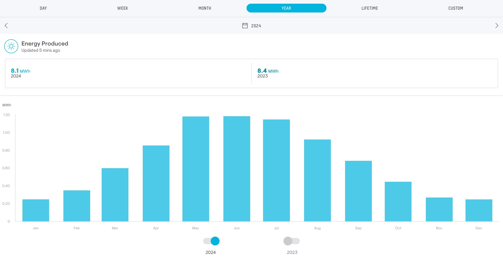

---

# Data: PV Generation — Best Day (June 13, 2024)

- **41.7 kWh** generated on June 13, 2024
- Peak output around solar noon

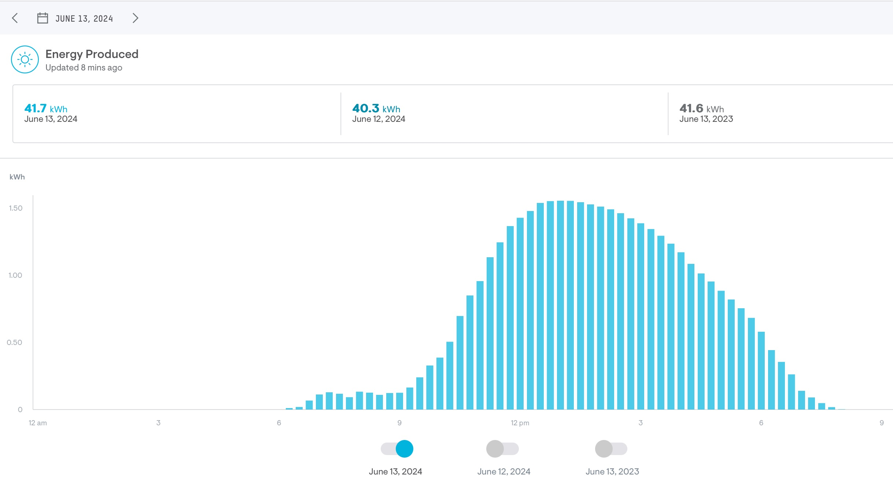

---

# Conclusions from the Data

- On average, using **250 kWh more** electricity per month than pre-electrification
- But using **500 kWh less** from the grid
- PV generation makes up the difference: **750 kWh**
- **200A service is more than sufficient** — even without active load management
- Additional electricity cost without PV is immaterial
- With PV: completely electrified **and** lowered the electricity bill
- Gained **resilience** to grid outages

---

# Life After Electrification

| System | Experience |
|--------|-----------|
| **Insulation** | Massive improvement — second floor never more than a couple degrees warmer. Added ~20% to roofing cost, money very well spent |
| **Hot Water** | Zero change, no problems. HP-WH always uses heat pump, never resistive coils |
| **HVAC** | Vastly improved A/C. Multi-zone variable speed = better comfort. Space heating: does the job. Very efficient and quiet |
| **Induction Cooktop** | Just as good, if not better. Electronic temp control arguably more precise |
| **EV** | Best vehicle I've ever owned. Level 2 home charging vastly superior to gas stations |

> **No compromises, sacrifices, or negative lifestyle impacts.** Electrified life outperforms in every way — plus it's cleaner, safer, and guilt-free.

---

# Service Feed Size

- Based on experience and data, **200A is more than enough** for nearly all homes
- 400A service seems unnecessary — NEC load calcs are insanely conservative
- What about homes with **100A service**?
  - EMS/PCS technology (UL 916 smart panels) can intelligently manage total load
  - Most 100A homes can electrify **without a costly service upgrade**
  - Smart panel investment pays for itself through avoided upgrade costs

> Existing service feed size is NOT an obstacle to electrifying most homes.

---

# Grid Impacts of Electrification

- Data suggests grid impact projections may be more conservative than necessary
- Current adoption rates for HP-WH and HP-HVAC have modest grid impact
- No need to hold back motivated customers while waiting for grid upgrades

### The opportunity:

- Support customer adoption while upgrading the grid **in parallel**
- Crawl, walk, run — start now and scale gradually
- Rethink grid management: balance responsible management with ongoing electrification

---

# Smarter Grid Management with Smart Controls

Historically, grids were designed to handle worst-case peak load with no active demand management.

**Today:** EMS/PCS technology in smart panels offers real-time, per-customer load management.

### Key question:
How does the cost of installing EMS/PCS panels at every home compare to grid modernization?

**Example:** 15K homes x $1K = $15 million

With granular control, the distribution network no longer needs to be oversized for unconstrained demand. Demand can be optimized in real time — **deferring or avoiding costly infrastructure upgrades**.

---

# Where the Puck Is Going

- **Hourly dynamic pricing** via open protocols like OpenADR 3.1
- **Bi-directional pricing** — addressing NEM concerns, incentivizing storage
- **V2X-enabled EVs** — household backup power and flexible grid resource
- **Fixed connection charges** based on service feed size: $(100A) < $(200A) << $(400A)
- **All high-load appliances** will be network-connected and demand-flexible (CEC FDAS)
- **Home automation** going mainstream via Matter — active energy optimization

---

# "Nobody Else Can Afford This!"

I respectfully disagree. Many people can do most of this, **over time**, with planning:

| Component | When |
|-----------|------|
| **HP Water Heater** | When your WH needs replacing (10-12 years) |
| **HP HVAC** | When your HVAC needs replacing (15-20 years) |
| **Induction Cooktop** | Kitchen update |
| **EV** | Plan for your next vehicle to be electric |
| **Battery** | Wait for V2X-EVSE + EV — no need for dedicated BESS |
| **Smart Panel** | At 100A service: cheaper than a service upgrade |
| **Solar PV** | Totally optional — your choice |

Electrification is a journey, not a single project.

---

# Surviving a Grid Outage (Electrified)

| Need | With Battery Backup | Without |
|------|-------------------|---------|
| Fridge, lights, Internet | Easy | Same as anyone |
| Hot water | HP-WH very efficient on battery | 50+ gal tank lasts a while |
| Cooking | Possible but big drain — use outdoor BBQ | Gas cooktops can be manually lit |
| HVAC | Possible but significant drain | Gas furnace needs electricity too |
| EV charging | Would drain all capacity — keep EV charged! | N/A |
| Laundry | Defer until power restored | Same |

> Keep your EV charged. Most gas appliances need electricity too. Battery backup covers essentials.

---

# Final Thoughts

- Practicing what we preach: fully electrified, lower bills, better comfort, grid resilient
- 200A service is sufficient — smart panels make even 100A work
- Grid impacts are manageable — start electrifying now, upgrade grid in parallel
- Dynamic pricing + smart controls = the future of grid management
- **No compromises.** Electrified life is simply better.
